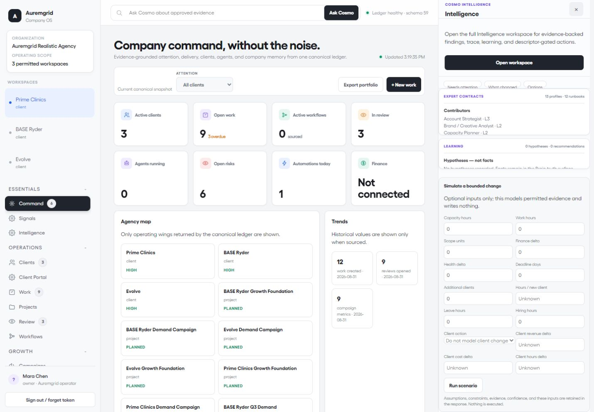
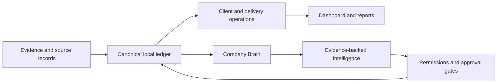

# Auremgrid Company OS

Auremgrid is a local-first operating system for an agency. It puts the records that run client work — evidence, projects, reviews, risks, campaigns, finance inputs, people, agents, automations, and reports — in one organization-scoped SQLite ledger.

It is designed for a private operator-run deployment, not a hosted SaaS or an autonomous external-action service.



**SAMPLE DATA:** This is a real capture of the checked-in dashboard running the `demo-agency` fixture. It shows three synthetic client workspaces; finance is intentionally disconnected and no customer data is included.

## What it does



| Area | In the code |
|---|---|
| Run the agency | Organizations, workspaces, people, clients, projects, deliverables, work, dependencies, time, reviews, approvals, workflows, risks, opportunities, meetings, and reports. |
| Keep the context | Documents, facts, relations, citations, history, conflicts, proposals, saved/customized views, FTS5 search, local graph projection, and optional local semantic projection. |
| Track money and capacity | Source-backed revenue, invoices, costs, budgets, software and AI-usage costs, client economics, skills, availability, leave, and capacity boards. Unknown or disconnected values remain unknown. |
| Coordinate agents safely | Agent records, workspace/tool policies, queues, runs, traces, costs, task review, bounded delegation, training-mode automation, durable jobs, and approved reversible local actions. |
| Connect deliberately | Read paths for selected providers, read-only import adapters, OAuth/PKCE and credential boundaries, sync state, quarantines, backups, restores, and an asset-recovery registry. |

## First 30 minutes

Requirements: Python 3.12+ and a normal SQLite build with FTS5. The default local path does not need Node, Docker, a network service, or an API key.

1. Create a private agency and its first dashboard session.

   ```text
   python scripts/auremgrid.py setup-agency --db "C:\data\agency.sqlite" --agency "Northwind Studio" --admin-name "Nora Owner" --admin-email "nora@northwind.example"
   ```

2. Start the local dashboard and API.

   ```text
   python scripts/auremgrid.py serve --host 127.0.0.1 --port 8791 --db "C:\data\agency.sqlite"
   ```

3. Open `http://127.0.0.1:8791/` and enter the one-time session token printed by setup. Tokens are stored only in that browser profile; do not put them in chat, URLs, screenshots, tickets, or source control.

For a populated walkthrough instead of a blank agency:

```text
python scripts/auremgrid.py demo-agency --db "C:\data\auremgrid-agency.sqlite"
python scripts/auremgrid.py bootstrap-auth --db "C:\data\auremgrid-agency.sqlite" --organization org_realistic_agency_demo --person person_realistic_owner --email person_realistic_owner@demo.invalid --workspace ws_prime_clinics --actor act_ws_prime_clinics
```

`demo-agency` creates synthetic clients, projects, work, reviews, campaigns, creatives, capacity records, risks, decisions, signals, agent runs, a training-mode automation, a report, and Intelligence evidence. The finance connection stays deliberately disconnected.

Use `demo` for the small offline search fixture:

```text
python scripts/auremgrid.py demo --db "C:\data\auremgrid-demo.sqlite"
```

## Daily operation

| Need | Command or surface |
|---|---|
| Import first records safely | `import-templates`, then `import-preview`, then `import-commit`; preview is durable but does not create business records. |
| Run background work | `python scripts/auremgrid.py worker-once --db "C:\data\agency.sqlite" --organization <organization-id> --worker-id local-worker-1` |
| Protect the ledger | `python scripts/auremgrid.py backup --db "C:\data\agency.sqlite" --output "C:\data\backups\agency.sqlite"` then `python scripts/auremgrid.py verify-backup --backup "C:\data\backups\agency.sqlite"` |
| Recover intentionally | `restore` verifies the source, creates a safety backup before replacement, revokes sessions, recovers in-flight jobs, and keeps outbound dispatch disabled. |
| Inspect the system | The dashboard includes Command, Clients, Client Portal, Work, Projects, Review, Workflows, Campaigns, Content, Creative, Brain, Meetings, People, Finance, Agents, Automations, Reports, Integrations, Settings, Onboarding, Retention, and Operator health. |

The API is implemented in [`src/auremgrid/api/http.py`](src/auremgrid/api/http.py), the tool router in [`src/auremgrid/api/mcp.py`](src/auremgrid/api/mcp.py), and the dashboard in [`src/auremgrid/api/dashboard`](src/auremgrid/api/dashboard). JSON/data routes require a bearer session or API token except `/health`, `/metrics`, and `/health/detailed`.

## Boundaries that matter

| Status | Scope |
|---|---|
| Implemented locally | The canonical SQLite ledger, dashboard, REST API, tool router, workers, CSV onboarding, backups/recovery, local Brain, delivery workflows, finance records, intelligence contracts, and private-host templates. |
| Live read after operator setup | Slack, ClickUp, Google Drive, Gmail, exact-file Figma, and one mapped Fireflies account. These need configured credentials, mappings, verification, and workers. |
| Import-only | Stripe Billing/accounting, Meta Ads, Google Ads, and CRM adapters normalize injected read data; they do not mutate providers. |
| Optional | Existing on-disk SentenceTransformers models, Graphiti/Neo4j projection, and a configured strategic reasoning endpoint. |
| Not packaged | Hosted multi-tenant operation, public signup/password recovery, bundled provider credentials, provider writes, email/report sends, publishing, live accounting reconciliation, arbitrary model actions, and binary asset storage or restore workers. |

The safety model is intentional: organization and workspace permissions are checked before lookup; source ACLs apply before search and aggregation; evidence preserves provenance; model output is not canonical truth by default; and external or one-way actions remain human-gated.

## Repository map

```text
src/auremgrid/     application: API, dashboard, services, connectors, domain, storage
fixtures/          synthetic operating fixtures and workflow catalogue
tests/             offline integration coverage and optional browser verification
docs/              architecture, setup, security, operations, API, and release evidence
deploy/            private single-host Docker Compose and Caddy templates
scripts/           launcher, release checks, smoke tests, and local utilities
```

The Python package is `auremgrid-company-os`; the import surface exports `CompanyOS` from `auremgrid.services.brain`. Schema 59 is the current migration line; `/health/detailed` reports the version of the opened database.

## Verify a checkout

```text
.\tools\test.ps1
python -m unittest discover -s tests
python -m compileall -q src tests
python -m auremgrid.cli evaluate-intelligence
python scripts/dashboard_showcase_image.py
git diff --check
```

Optional browser verification:

```text
python -m pip install --no-build-isolation -e ".[browser]"
.\tools\run-dashboard-browser.ps1 -InstallChromium
```

## Documentation

- [Architecture](docs/architecture.md) · [Domain model](docs/domain-model.md) · [Operating model](docs/operating-model.md)
- [Dashboard architecture](docs/dashboard-architecture.md) · [REST API](docs/api-reference.md) · [MCP tools](docs/mcp-reference.md)
- [Authentication](docs/authentication.md) · [Permissions](docs/permission-model.md) · [Agent model](docs/agent-model.md)
- [Connectors](docs/connector-model.md) · [Secure integrations](docs/secure-integrations.md) · [Jobs and recovery](docs/jobs-and-recovery.md)
- [Finance](docs/finance-model.md) · [Asset and backup policy](docs/asset-backup-policy.md) · [Local deployment](docs/local-deployment.md)
- [Production checklist](docs/production-checklist.md) · [Release verification](docs/release-verification.md) · [Upgrade guide](docs/upgrade-guide.md)

Fixtures are synthetic. Do not commit client, employee, credential, or financial data.

License: Apache-2.0. See [LICENSE](LICENSE) and [THIRD_PARTY](THIRD_PARTY.md).
