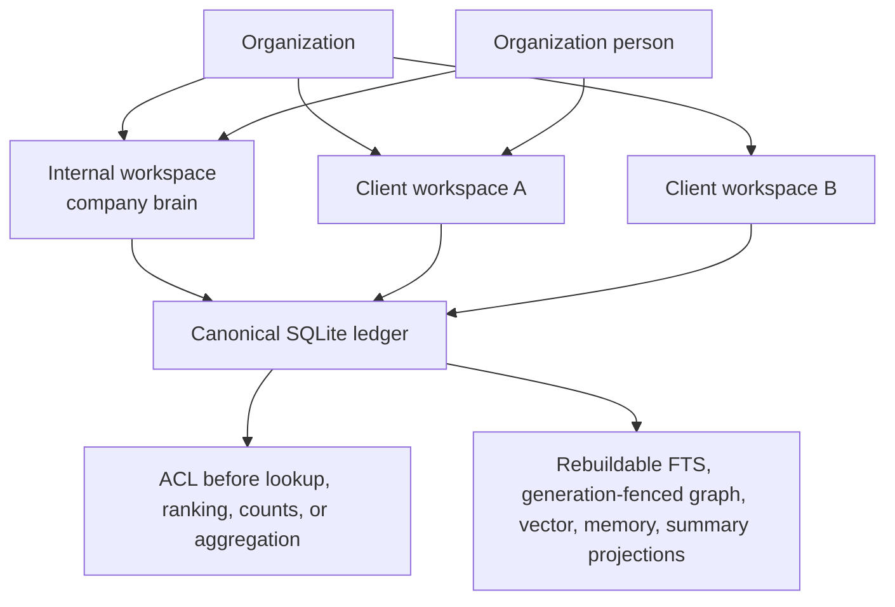
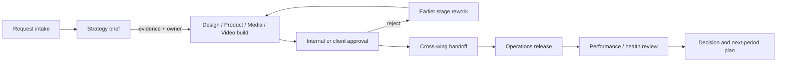
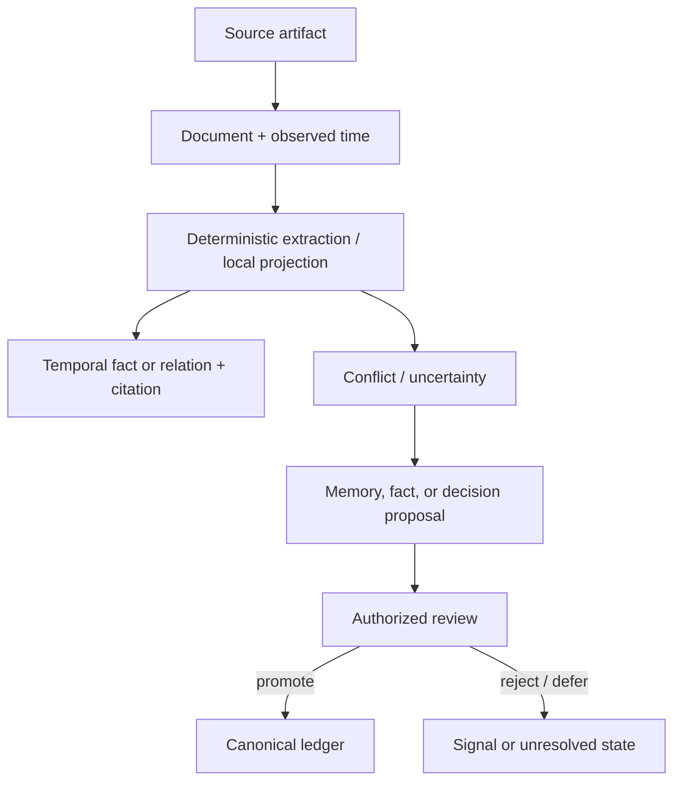
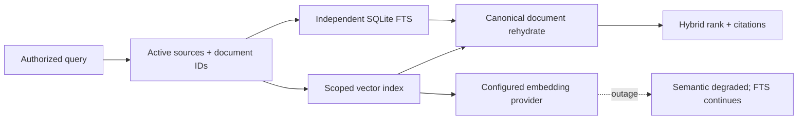
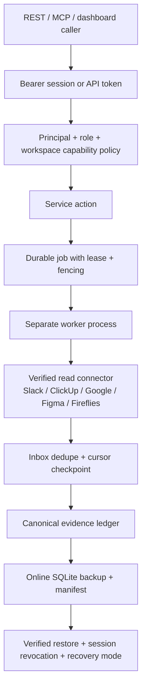
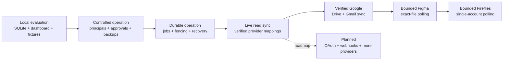
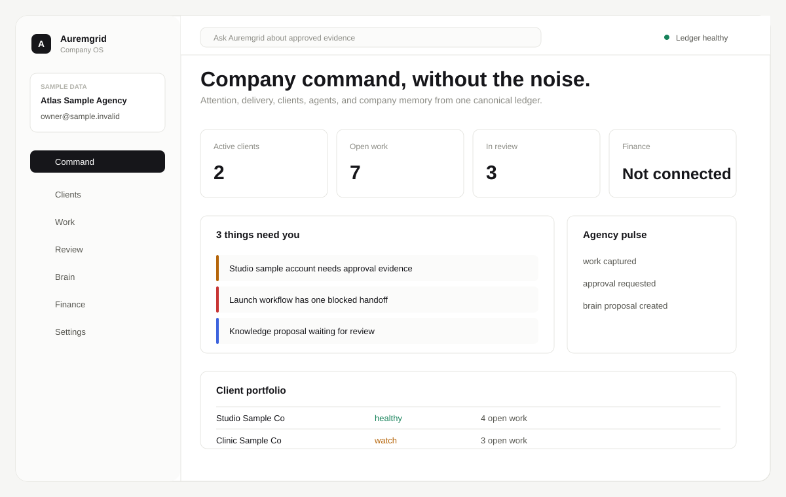

# Auremgrid Company OS

Auremgrid is a local-first operating system for an agency that needs one auditable place for client context, delivery work, approvals, evidence, and operating decisions. It uses an organization-scoped SQLite ledger as the canonical record and rebuildable local projections for search and analysis.

The product decision is simple: keep authority, permissions, provenance, and temporal history in a small system the agency can inspect and back up itself; connect external tools only through explicit, restart-safe adapters.

## Executive view

### The problem it addresses

Agency work is usually split across conversations, task boards, documents, design files, campaign tools, finance tools, and spreadsheets. That makes it hard to answer basic operating questions: what was promised, who owns the next step, which client can see a record, what evidence supports a claim, and what is waiting for approval.

### What Auremgrid changes

- A single organization and workspace boundary for people, clients, projects, work, decisions, evidence, and audit history.
- A temporal company brain: source documents, facts, relations, citations, conflicts, proposals, and signals remain distinguishable.
- Executable cross-wing workflows with dependencies, evidence gates, approvals, handoffs, SLAs, escalation, rework, and immutable run snapshots.
- Durable jobs and connector sync that can restart without silently advancing a cursor or claiming a provider is healthy when it is not.
- A local dashboard, REST API, MCP-style tools, and CLI over the same policy and canonical ledger.

This is an operating control plane, not a replacement for every specialist tool. Slack, ClickUp, Google Drive, Gmail, explicitly mapped Figma files, and a single mapped Fireflies account have credential-backed read synchronization with provider verification, durable backfill, fenced workers, and lifecycle-aware evidence. Figma polling is bounded to verified exact-file mappings; Fireflies polling is bounded to one verified account mapping.

## Who it serves—and who it does not

### Good fit

- Retainer or project agencies coordinating strategy, product, paid media, design, video, and operations across several client workspaces.
- Owners and operations leads who need explainable health, scope, risk, and delivery status rather than another unscoped task list.
- Teams that prefer local control, inspectable SQLite, explicit backups, and reversible connector integrations.
- Technical operators who can run a Python process and keep a durable database path available to the worker and backup process.

### Not the right first choice

- A team seeking a hosted CRM, a full accounting system, or a general-purpose project-management replacement.
- A company that requires managed multi-region availability, built-in OAuth installation, or guaranteed unattended production operations today.
- A workload that needs high-volume event streaming or binary asset storage; Auremgrid records metadata, evidence, and links while asset backup remains a separate policy.

## Outcomes and use cases

| Operating question | Auremgrid outcome |
|---|---|
| “What is true for this client, and when was it true?” | Cited facts with observed time, validity windows, source permissions, and conflict history. |
| “What should happen next?” | Work items, dependencies, owners, forced review, and accountable notifications. |
| “Can this request move across several disciplines?” | Versioned workflow template, stage evidence, approval gate, handoff contract, SLA, and rework route. |
| “Are we drifting from the agreement?” | Contract allowances, scope usage, risks, opportunities, health explanations, and decision records. |
| “Can a worker or connector resume safely?” | Leased jobs, fencing, retries, dead letters, inbox dedupe, durable cursors, and explicit degraded state. |
| “Can an assistant change the company record?” | No silently: AI outputs enter as proposals/signals and promotion remains human or policy controlled. |

## Capability map

| Module | What it provides | Current status |
|---|---|---|
| Organization and identity | Organizations, internal/client workspaces, people, memberships, principals, sessions, API tokens, actor bindings | Implemented; deny-by-default policy |
| Company brain | Sources, documents, temporal facts, relations, citations, aliases, conflicts, history, proposals, knowledge health | Implemented; SQLite FTS5 and local projections |
| Client operations | Briefs, health explanations, risks, opportunities, contacts, relationships, meetings, conversations, unanswered requests | Implemented |
| Projects and delivery | Projects, work hierarchy, subtasks, dependencies, comments, files, versions, time entries, reviews, approvals, forced delivery stages | Implemented |
| Client portal | Client-role identities, bounded intake request front door with explicit staff accept/decline, client comments and decisions on client-kind reviews only | Implemented |
| Cross-wing workflows | Neutral templates, immutable definition versions/runs, readiness, evidence, gates, handoffs, SLAs, escalation, cancellation, rework | Implemented; eight representative templates |
| Campaigns and content | Campaigns, sourced metrics, creatives, content stages, performance snapshots | Implemented; values remain unknown/not connected until sourced |
| People and capacity | Skills, availability, leave, derived weekly workload/capacity by person, account, and wing | Implemented |
| Finance | Connection state, invoices, revenue, costs, budgets, software/AI cost records, client economics | Implemented schema and sourced records; never fabricates values |
| Agents and automations | Agent records, scoped roles, tasks, queues, runs, tool calls, outputs, costs, traces, training-mode automations | Implemented; unattended automation remains experimental |
| Integrations | Explicit mappings, external secret references, verification, sync runs, connector inbox/dedupe | Slack, ClickUp, Google Drive, Gmail, bounded exact-file Figma, and single-account Fireflies live read sync; Drive/Gmail use folder/drive and label mappings with redacted overlap quarantine; GitHub and other providers remain disabled catalog-only entries |
| Jobs, outbox, recovery | Atomic claims, leases, fencing, progress, retry/backoff, dead letters, cancellation, idempotency, append-only events, recovery mode | Implemented; outbound sends remain a future gate |
| Interfaces | Local dashboard, REST API, MCP-style router, CLI | Implemented; all policy remains service-side |
| Storage and projections | Versioned SQLite migrations, online backups, checksums, integrity/FK verification, restart-safe rebuilds | Implemented; external binary assets require separate backup |
| Feedback and learning | Record feedback, detect recurring patterns, promote preferences, approve/reject decisions | Implemented; pattern promotion requires configurable threshold |
| Performance insights | Anomaly detection, creative and channel comparisons, insight approval workflow | Implemented; insights require sourced metric snapshots |
| Forecasting | Revenue, client renewal, capacity, and utilization projections from recorded data | Implemented; projections are point-in-time and require historical data |
| Data lifecycle and retention | Retention policies, scoped deletion with allowlist, workspace export, deletion audit trail | Implemented; outbound archive/redact actions remain future |

## How the system hangs together

### Company hierarchy and data isolation



People are organization-level identities. A person can span client workspaces, but every read and write is scoped through organization and workspace membership. Denied records are not disclosed through counts, ranking, or existence checks.

### Request-to-delivery cross-wing workflow



Each run snapshots the validated definition. Dependencies control readiness; stage order is the canonical presentation sequence. One-way gates require evidence and an approver, and rejected work records its route back.

### Evidence, knowledge, and proposals



Source text is evidence, not executable instruction. AI-generated output is not silently promoted into canonical truth.

### Semantic retrieval (schema 16)



The default provider is a deterministic, offline lexical fallback so a new installation works without model files or network access. Its health explicitly reports `fallback_used=true`. Schema 16 stores rebuildable float32 vectors in `document_embedding_projection`, scoped by workspace, document, provider, model, version, and dimensions. Retrieval authorizes active source/document IDs before either channel runs; semantic candidates are never gated by an FTS hit and are rehydrated from canonical SQLite rows before ranking. An opted-in provider outage is reported as `semantic=degraded` with `fallback_used=false` while cited FTS evidence and startup remain available.

For a local SentenceTransformers model, install the optional dependency with `pip install -e ".[semantic]"`, then pass `--semantic-model-path`, `--semantic-model`, and `--semantic-version` to each long-running command. The path must already be a model directory; loading is lazy and uses `local_files_only=True`, so the application never downloads weights. The same values can be set locally as `AUREMGRID_SEMANTIC_MODEL_PATH`, `AUREMGRID_SEMANTIC_MODEL`, and `AUREMGRID_SEMANTIC_VERSION`. Keep all server and worker processes on the same explicit identity/version. Changing either version or dimensions rebuilds the disposable projection under the new contract; verify semantic health before relying on vector results.

Graph projection uses the same boundary: the dependency-free local temporal graph is the default, is rebuildable, and schema 17 records building/active/failed generations. A real Graphiti/Neo4j adapter is opt-in only (`pip install -e ".[graphiti]"` plus explicit `AUREMGRID_GRAPHITI_*` settings); it requires configured OpenAI-compatible LLM and embedder endpoints and never silently claims to be connected. Upstream reads are permitted only when the actor has full workspace source access; partial ACL scopes skip the upstream channel while canonical, FTS, and semantic retrieval continue. Every remote result is mapped through schema 21's append-only canonical episode-key/provider-UUID sidecar and rehydrated from canonical SQLite evidence. Rebuilds stage a generation before SQLite activates it; restart restores complete mappings without rewriting remote episodes and rebuilds incomplete generations from canonical evidence. Failures leave the last verified generation available and mark only graph health degraded/unavailable; health output is sanitized.

### Entity resolution and knowledge states (schema 18)

Entity matching is a proposal workflow, not an automatic merge. `GET /entity/candidates` and MCP `brain.entity.candidates` can suggest deterministic name/domain variants only when the caller can see the supporting source evidence; discovery writes nothing. Candidate aliases and merges are scoped to one organization/workspace and remain pending until an identity with `brain_promote` records an immutable decision. A merge creates a one-way redirect while preserving the original entity, alias owner, evidence, and decision history; alias lifecycle changes are append-only state events. Ordinary extracted facts begin as `inferred`; an exceptional extraction confidence of at least 0.95 is explicitly `high_confidence`, while human promotion remains `verified`. Incompatible observations remain together with both citations in a conflict group, and a later human resolution appends `verified`/`stale` events without deleting history. Current search and health use the latest effective state; historical `as_of` queries can still inspect prior states. A scoped service/agent identity may propose but cannot promote, and cross-workspace candidates are rejected without disclosure.

### Capability-level routing (schema 19)

Agent work is classified into four provider-neutral capability levels. Tasks persist their intent tags, recommended level, selected level, and any explicit escalation reason. Existing agent identities are upgraded without changing their IDs, under-leveled assignments and de-escalation are rejected, and every override is recorded in an immutable audit table. Business titles and organization permissions remain separate from these execution levels.

### Client account rosters (schema 20)

Each client workspace can keep immutable, effective-dated account rosters for the client-success DRI and backup, account and wing leads/executives, cadence and escalation owners, and default meeting facilitator/note-taker. These business assignments never grant system permissions. New workflow runs resolve eligible roster roles once and snapshot the selected people and roster version; later roster changes affect only new runs. Meeting responsibility changes are append-only and historical reads remain available through `as_of`.

The Client HQ view projects that roster into explicit accountability slots, meeting ownership, workload, and workflow readiness. Weekly capacity is derived at read time from canonical availability, approved leave, recorded time, remaining work estimates, and immutable workflow-stage estimates; it never treats a stale capacity snapshot as operational truth. Account demand and wing demand remain separate views so the system does not invent an allocation of a person's availability across clients.

### Authentication, jobs, connectors, and recovery



Credentials are externally referenced and resolved only inside authorized execution. Hashes/fingerprints and sanitized metadata may be recorded; secret values and authorization headers are not.

### Rollout maturity



The last line is a roadmap, not a current capability claim.

## Requirements

### Minimum for a local evaluation

- Windows, macOS, or Linux with a supported 64-bit Python 3.12+ runtime.
- SQLite built with FTS5 (the standard Python SQLite build normally includes it).
- Unverified evaluation estimate: 2 CPU cores, 4 GB RAM, and 1 GB free disk for the synthetic demo and tests. Measure your own workload before production use.
- A durable writable path for the SQLite file; no Docker, Node, API key, or network service is required for the offline path.

### Recommended for a small agency deployment

- 4 CPU cores, 8–16 GB RAM, SSD storage, and a filesystem with reliable locking and scheduled snapshots.
- Separate web and worker processes using the same durable database path.
- A secret manager or environment-backed secret store, plus an independent backup destination and restore rehearsal.
- Restrict the listening interface to localhost or a private network until a reverse proxy, TLS, and operational access policy are in place.

## Setup: clone to a working local system

```text
git clone <repository-url>
cd Auremgrid-Company-OS
python scripts/auremgrid.py --help
```

## Dashboard preview



The image above is a deterministic SAMPLE DATA preview for GitHub. It is not
embedded in the production dashboard and does not come from a customer
database. To view the actual interactive dashboard locally, create a seeded
evaluation database, issue a local session token, start the server, then open
`http://127.0.0.1:8791/`:

```text
python scripts/auremgrid.py demo --db "C:\data\auremgrid-demo.sqlite"
python scripts/auremgrid.py bootstrap-auth --db "C:\data\auremgrid-demo.sqlite" --organization org_demo --person person_demo_owner --email owner@demo.invalid --workspace ws_alpha --actor act_alpha_admin
python scripts/auremgrid.py serve --host 127.0.0.1 --port 8791 --db "C:\data\auremgrid-demo.sqlite"
```

The launcher is the zero-install path: it runs directly from this trusted
checkout, does not change directory, install packages, or contact a network.
Use an explicit absolute database path when operating outside the repository:

```text
python scripts/auremgrid.py demo --db C:\data\auremgrid-demo.sqlite
python scripts/auremgrid.py bootstrap-auth --db C:\data\auremgrid-demo.sqlite --organization org_demo --person person_demo_owner --email owner@demo.invalid --workspace ws_alpha --actor act_alpha_admin
```

Optional editable installation requires Python 3.12+, a local setuptools 68+
build backend, and (for offline use) disabled build isolation:

```text
python -m pip install --no-build-isolation --no-deps -e .
```
Do not run installation from an untrusted checkout.

Run the offline verification suite:

```text
.\tools\test.ps1                 # PowerShell
python -m unittest discover -s tests
```

Create a seeded evaluation database, issue its first local session, then start the server:

```text
python scripts/auremgrid.py demo --db "C:\data\auremgrid-demo.sqlite"
python scripts/auremgrid.py bootstrap-auth --db "C:\data\auremgrid-demo.sqlite" --organization org_demo --person person_demo_owner --email owner@demo.invalid --workspace ws_alpha --actor act_alpha_admin
python scripts/auremgrid.py serve --host 127.0.0.1 --port 8791 --db "C:\data\auremgrid-demo.sqlite"
```

The bootstrap command prints the session token once. Open `http://127.0.0.1:8791/` and paste that token when prompted. For a real organization database, create or import the organization and person records first, then bootstrap the first principal:

```text
python scripts/auremgrid.py bootstrap-auth --db "C:\data\agency.sqlite" --organization <organization-id> --person <person-id> --email owner@example.invalid --workspace <workspace-id> --actor <legacy-actor-id>
```

The token is not recoverable from the database; the dashboard stores the supplied value in browser-local storage, while API clients can keep it in an environment variable. Run one durable job in a separate process:

```text
python scripts/auremgrid.py worker-once --db "C:\data\agency.sqlite" --organization <organization-id> --workspace <workspace-id> --worker-id local-worker-1
```

Create and verify an online backup without copying a live WAL file:

```text
python scripts/auremgrid.py backup --db "C:\data\agency.sqlite" --output "C:\data\backups\agency.sqlite"
python scripts/auremgrid.py verify-backup --backup "C:\data\backups\agency.sqlite"
```

Restore is intentionally an explicit offline operation and requires the verified backup plus `--overwrite` when replacing an existing destination.

## First 30 minutes

1. **Minutes 0–5 — Start the seeded system.** Run `demo`, `bootstrap-auth`, and `serve` as shown above; open the dashboard and inspect the internal workspace plus two synthetic client workspaces.
2. **Minutes 5–10 — Read the brain.** Use the search box and client brief to inspect a cited result, its source, and the distinction between known and unknown information.
3. **Minutes 10–15 — Inspect delivery control.** Open a project and its work/review records in the dashboard. Use the authenticated REST/MCP work endpoints for assignment, checklist, and review transitions; the dashboard currently presents those records but does not expose every mutation control.
4. **Minutes 15–20 — Inspect a workflow.** Use the workflow REST/MCP endpoints to list the neutral templates, create a `landing_page` or `campaign_launch` run, start a ready stage, attach evidence, and then return to the dashboard to see the canonical stage board. Brain shows pending proposals, unresolved conflicts, current truths, and semantic/graph health. Where the authenticated row exposes `allowed_actions`, the dashboard offers capability-gated confirmation actions with idempotent descriptors; historical rows expose no controls.
5. **Minutes 20–25 — Inspect control surfaces.** Visit people/capacity, finance, integrations, jobs, and activity. `not_connected` and unknown values are intentional when no source is configured.
6. **Minutes 25–30 — Exercise recovery.** Run `backup` and `verify-backup`, inspect the manifest, and review [jobs and recovery](docs/jobs-and-recovery.md) before connecting any external provider.

## API and MCP examples

The examples below use placeholders, not real credentials. All JSON and data routes except `/health` require a bearer session or API token. The unauthenticated `/` and `/dashboard` routes serve only the static shell; its data requests still require the token. The server derives identity from the credential, so caller-supplied person, actor, and organization values cannot impersonate another principal.

Health check:

```http
GET /health HTTP/1.1
Host: 127.0.0.1:8791
```

Authenticated identity:

```text
curl http://127.0.0.1:8791/auth/me \
  -H "Authorization: Bearer ${AUREMGRID_SESSION_TOKEN}"
```

Create an idempotent workflow run:

```text
curl -X POST http://127.0.0.1:8791/workflows/runs \
  -H "Authorization: Bearer ${AUREMGRID_SESSION_TOKEN}" \
  -H "Content-Type: application/json" \
  -d '{"organization_id":"<org>","workspace_id":"<workspace>","template_id":"landing_page","idempotency_key":"demo-run-001"}'
```

The MCP-style interface exposes the same service policy through namespaced tools, for example:

```json
{
  "name": "workflows.templates",
  "arguments": {"organization_id": "<org>", "wing": "Design"}
}
```

See [REST API reference](docs/api-reference.md) and [MCP tools](docs/mcp-reference.md) for route/tool coverage and capability requirements.

## Deployment modes

### Local evaluation

One Python process serves the dashboard/API over localhost and uses SQLite. Synthetic fixtures and simulated connectors keep the path offline.

### Controlled single-host operation

Run the web process and `worker-once` jobs as separate processes against a durable SQLite file. Use filesystem permissions, a private bind address, scheduled online backups, and a tested restore destination. This is the intended current operating mode for a small agency.

### External-provider read sync

Bind an external environment reference, verify the provider account and mapped streams, then enqueue a `connector.sync` job. Slack, ClickUp, Google Drive, Gmail, explicitly mapped Figma files, and a single mapped Fireflies account are supported for read synchronization. Figma is bounded to verified `file:<key>` mappings: a fetched, version-fenced file snapshot can retain bounded frame/section evidence, but its parent file is the only lifecycle and object-count record. It does not synchronize review or approval workflows or auto-create deliverables, reviews, or tasks. Fireflies is bounded to exactly one verified `account:<id>` mapping and polls transcripts by a durable date cursor, emitting one sanitized, bounded transcript event per meeting. The worker resolves the secret at execution time and records sanitized state only.

### CI and development

Run the unittest suite with synthetic fixtures and injected connector transports. No private accounts or network access are needed. Networked semantic engines and unattended automations remain optional/experimental.

## Security and trust boundaries

- Organization membership and workspace membership are checked before retrieval, ranking, aggregation, counts, or existence disclosure.
- Sessions and API tokens are opaque; only hashes are stored. API-token scopes narrow role capabilities. Workspace viewer cannot write.
- External secrets are references/fingerprints. They are resolved only inside authorized connector/job execution and recursively redacted from payloads, evidence, jobs, outbox records, and errors.
- Source evidence is untrusted data and cannot issue instructions. Extracted uncertainty becomes a proposal or signal; canonical facts are append-only observations with provenance.
- Durable jobs use atomic claims, leases, retries, dead-letter state, idempotency, and fencing. A stale worker cannot complete a reclaimed job.
- Restore revokes sessions, recovers in-flight jobs, enables recovery mode, and disables outbound dispatch until a human exits recovery mode.
- The current HTTP server is a local standard-library server. Put a reverse proxy/TLS/access policy in front of any non-local deployment; production hardening is not claimed by this repository.

## Verified evidence and release discipline

The authoritative release matrix is [release verification](docs/release-verification.md). It tracks isolation, persistence, permissions, workflow gates, projection rebuilds, migration-forward behavior, job fencing, credential redaction, backup verification, dashboard behavior, and live connector sync safety, including bounded exact-file Figma polling.

Before a release or schema change, run:

```text
.\tools\test.ps1
python -m compileall -q src tests
git diff --check
```

The offline suite must not require Docker, provider credentials, a private vault, or network access. Live provider tests use deterministic injected transports; they do not claim that a customer account was connected.

## Current limitations and roadmap

- No in-product OAuth installation/callback flow, webhook ingestion, or refresh-token rotation; credential binding is manual and environment-backed.
- Google Drive bootstraps from a captured changes token, walks mapped folders/shared drives through durable continuation tasks, reconciles parent chains and descendants after moves, and retires objects only after ancestry is resolved. Gmail captures a history baseline before label backfill and maintains label membership lifecycle. Objects that match mappings owned by different workspaces create an organization-level redacted quarantine, block cursor promotion, and write no workspace evidence.
- Figma supports verified, exact-file read polling with `current_user:read`, `file_metadata:read`, and `file_content:read`. A version-fenced file snapshot can retain bounded frame/section evidence; with explicit, proven `file_versions:read`, a changed file can also retain one bounded page of named-version evidence, and with explicit, proven `comments:read`, bounded comment evidence. The parent file remains the only lifecycle and object-count record. Review/approval workflows and auto-created deliverables, reviews, or tasks are out of scope. Fireflies supports verified, single-account read polling with `transcripts:read`, bounded to exactly one `account:<id>` mapping; it emits one sanitized, bounded transcript event per meeting from a durable date cursor and has no delete/tombstone signal. GitHub, advertising, and accounting systems remain disabled catalog entries only and do not report connected.
- Unattended automations, remote semantic providers, upstream OSS engines, and externally visible sends remain experimental or future gates. Local semantic retrieval and its deterministic fallback are available behind the provider/index boundary described above.
- SQLite is local-first, not a multi-region distributed database. External binary assets require a separate backup policy.
- The standard-library HTTP server is appropriate for local/private operation; hardened public deployment needs an explicit reverse proxy, TLS, and access review.

The next safe increments are OAuth/PKCE with a write-capable secret backend, webhooks and multiple provider installations, a transactional outbox boundary for externally visible sends, and a documented asset backup policy.

## Documentation map

- [Architecture](docs/architecture.md)
- [Domain model](docs/domain-model.md)
- [Operating model](docs/operating-model.md)
- [Wing workflow catalog](docs/wing-workflows.md)
- [Authentication and capabilities](docs/authentication.md)
- [Jobs, outbox, and recovery](docs/jobs-and-recovery.md)
- [Live connector synchronization](docs/live-connectors.md)
- [Data lifecycle](docs/data-lifecycle.md)
- [Permission model](docs/permission-model.md)
- [Threat model](docs/threat-model.md)
- [Dashboard architecture](docs/dashboard-architecture.md)
- [Agent model](docs/agent-model.md)
- [Finance model](docs/finance-model.md)
- [Connector model](docs/connector-model.md)
- [REST API](docs/api-reference.md)
- [MCP tools](docs/mcp-reference.md)
- [Upgrade guide](docs/upgrade-guide.md)
- [Release verification](docs/release-verification.md)

Fixtures are synthetic. Never commit private client, employee, credential, or financial data.

Apache-2.0.
