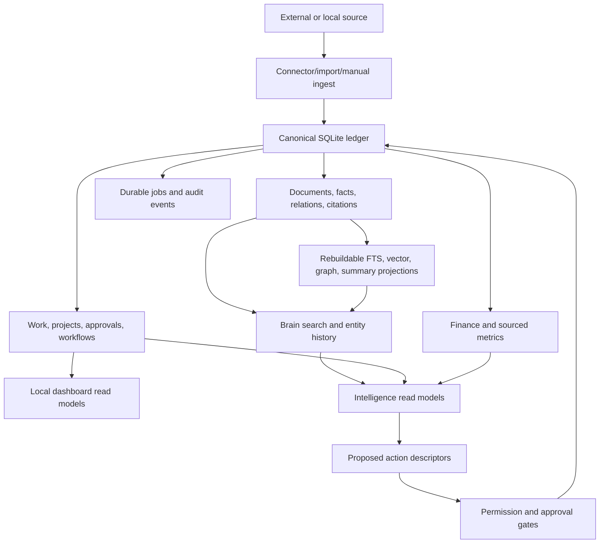

# Auremgrid Company OS

Auremgrid Company OS is a local-first operating control plane for an agency. It keeps client context, work, approvals, evidence, decisions, reports, agents, automations, connector sync state, and operating intelligence inside one organization-scoped ledger that the operator can inspect, back up, and run privately.

The repository is not a hosted SaaS, not a managed CRM, not an accounting system, and not an autonomous external-action agent. It is a Python 3.12 application with a SQLite canonical store, a local dashboard, REST routes, an MCP-style tool router, durable workers, deterministic fixtures, and provider boundaries that are deliberately explicit.

The core product idea is simple: keep authority in the local ledger; treat external systems as read sources or injected transports; require permissions, provenance, idempotency, and human approval before anything sensitive becomes canonical or executes.


**SAMPLE DATA:** The dashboard image is checked in for GitHub preview and does not represent a live customer environment.

## Current Status

| Area | Status | What that means |
|---|---|---|
| Local Company OS | IMPLEMENTED | Organization, workspaces, people, client records, projects, work, reviews, approvals, workflows, evidence, reports, finance records, agents, automations, jobs, and dashboard surfaces run against local SQLite. |
| Company Brain | IMPLEMENTED | Documents, facts, relations, citations, temporal history, conflict state, proposals, source ACLs, FTS5, deterministic semantic fallback, and local graph projection are implemented. |
| Intelligence | IMPLEMENTED | Dashboard, REST, and MCP surfaces can produce cited briefs, hypotheses, scenarios, recommendations, expert/runbook orchestration traces, learning records, evaluation telemetry, and proactive attention snapshots. They do not execute external actions or promote truth by themselves. |
| Live read connectors | LIVE READ | Slack, ClickUp, Google Drive, Gmail, exact-file Figma polling, and one mapped Fireflies account have credential-backed read sync paths when the operator supplies secrets, mappings, verification, and workers. |
| Provider imports | IMPORT-ONLY | Stripe Billing/accounting, Meta Ads, Google Ads, and CRM pages can be normalized through injected read-only import adapters. They are not live registered connectors and never mutate providers. |
| Finance | IMPLEMENTED | Finance stays `not_connected` until an organization admin connects the finance state. Revenue, invoices, costs, budgets, software costs, AI usage, and economics require explicit source records. No values are fabricated. |
| External sends | OUT OF SCOPE | Email sends, provider writes, public webhook operation, outbound report delivery, content publishing, and connector mutations are outside the packaged local demo unless an operator builds and approves the missing infrastructure. |
| Hosting | IMPLEMENTED | The included standard-library HTTP server, Dockerfile, Compose file, and Caddy config are private single-host templates, not managed production hosting. |

## What Is In This Repository

```text
src/auremgrid/
  api/                 REST server, MCP-style router, dashboard static assets
  adapters/            optional retrieval/projection adapters and local fallbacks
  connectors/          provider read connectors and injected import adapters
  domain/              typed domain objects and validation contracts
  extract/             deterministic fact extraction helpers
  services/            business services for work, brain, finance, agents, jobs, etc.
  storage/             SQLite/Postgres ports, migrations, repositories, backup/recovery
  cli.py               command-line entry point
  demo_agency.py       realistic synthetic agency seeding

docs/                  architecture, API, MCP, deployment, security, release evidence
fixtures/              synthetic playbooks, workflow catalog, sample client source files
scripts/               zero-install launcher, release checks, smoke tests, SVG generator
tests/                 offline unit/integration coverage plus optional browser tests
tools/                 local test and dashboard verification scripts
deploy/                private single-host Docker Compose and Caddy templates
```

The package name is `auremgrid-company-os`; the Python import surface exports `CompanyOS` from `auremgrid.services.brain`. The CLI script name is `auremgrid` when installed, and the repository also includes a zero-install launcher at `scripts/auremgrid.py`.

## Git Attribution Guard

This repository pins both Git identities to `Auremgrid <auremgrid@users.noreply.github.com>`, rejects third-party attribution trailers, and rejects the reserved third-party attribution reference in newly staged content. After cloning, activate the repository hooks once:

```powershell
powershell -ExecutionPolicy Bypass -File scripts/install-git-guard.ps1
```

The reusable instructions are in `skills/git-attribution-guard/SKILL.md`; `scripts/test-git-guard.ps1` exercises the protected cases in a temporary repository. Hooks protect ordinary commits and merge commits; Git's `--no-verify` option deliberately bypasses client-side hooks, so it must not be used for this repository. Existing published history is not rewritten by this setup.

The source currently carries a migration chain through schema version 58 for this release line. Runtime `/health` and `/health/detailed` report the actual schema version of the opened database.

## Capability Map

| Domain | Code-backed capabilities | Boundary |
|---|---|---|
| Organization and identity | Organizations, organization memberships, internal/client workspaces, workspace roles, people, principals, sessions, API tokens, actor bindings, local admin invites, revoke/rotate flows | No public signup, password reset, hosted auth, or email invite delivery is bundled. |
| Permissions | Organization role, workspace role, legacy actor scope, source ACLs, API-token scopes, agent workspace/tool policies, approval gates | ACLs run before lookup, aggregation, ranking, counts, and existence disclosure. |
| Company Brain | Sources, documents, facts, relations, memories, citations, entity candidates, temporal history, current effective state, conflicts, proposals, saved views, customizations, knowledge health | Extracted or AI-suggested information remains proposed/inferred until promoted by an authorized path. |
| Retrieval | SQLite FTS5, deterministic lexical semantic fallback, rebuildable vector projection, local temporal graph, optional local SentenceTransformers, optional Graphiti/Neo4j projection | Optional providers must be explicitly configured and can degrade without blocking canonical/FTS reads. |
| Client operations | Client briefs, health explanations, risks, opportunities, contacts, relationships, conversations, meetings, signals, account rosters, meeting responsibilities | Client account rosters are business accountability, not system permission grants. |
| Work and delivery | Projects, deliverables, work items, hierarchy, subtasks, dependencies, assignments, watchers, comments, files, versions, time entries, lifecycle transitions, review stages | State changes are validated server-side and often use expected versions and idempotency keys. |
| Reviews and approvals | Internal/client review records, comments, decisions, approval requests, approval decisions, rich annotations for comments/image regions/document regions/video ranges | Annotations are append-only metadata. The dashboard does not store binary asset data. |
| Client portal | Client intake queue, staff accept/decline, client comments and decisions on client-kind reviews, portal report reads/downloads | Client-role users do not receive general `workspace_write`; staff triage is required before intake becomes work. |
| Cross-wing workflows | Versioned templates, immutable run snapshots, stages, dependencies, evidence gates, approval gates, handoffs, SLAs, escalation, rework, cancellation, history | Workflow templates are local contracts. External triggers should provide idempotency keys. |
| Campaigns, content, creative | Campaigns, sourced metrics, creative assets/versions, content stages, performance records, lifecycle transitions, review history | Ad-platform publishing and live ads mutation are not packaged. Unknown metrics stay unknown. |
| Sales and revenue ops | Prospects, proposals, idempotent proposal-to-client conversion, contract/scope usage, retainer read models, report-pack approvals | Local ledger operations only; no live CRM sync or outbound proposal sending is claimed. |
| Finance | Finance connection state, revenue, invoices, costs, budgets, software costs, AI usage costs, client economics calculations | Every row needs a source. Economics derive from recorded rows only. Not accounting truth. |
| People and capacity | Skills, availability, leave, workload, weekly capacity boards, wing/account demand projections | Capacity is derived from current records; stale snapshots are not treated as operational truth. |
| Agents | Agent records, capability levels, allowed workspaces/tools, tasks, queues, runs, claims, traces, tool calls, outputs, failures, costs, review requests, delegation depth | Agents cannot enter undeclared workspaces or use undeclared tools. Level routing is separate from business titles. |
| Automations | Training-mode automations, triggers, approval checkpoints, durable execution jobs, reversible local actions | Unattended automation remains bounded to allowlisted reversible local actions. |
| Intelligence | Cited workspace/portfolio/executive briefs, hypotheses, scenarios, recommendations, expert profiles, runbooks, orchestration traces, recommendation learning, shadow evaluation safety, proactive attention lifecycle | Read-only by default. Optional reasoning providers are injected and schema-validated; provider failure falls back/degrades. |
| Reversible actions | Approved local catalog: `generate_report`, `create_notification`, `acknowledge_attention`, `create_risk`, `add_work_comment`, `create_proposal` | Execution requires a matching approved request, safe descriptor, scope checks, payload checks, idempotency, and execution ledger fencing. No arbitrary or external-send descriptor executes. |
| Integrations | Provider catalog, configuration, external secret references, verification, credential fingerprints, mapped streams, sync jobs, health, quarantine | Configuration never means connected. First successful worker sync earns connected state. |
| Durable jobs | Enqueue/list/get/cancel, atomic claims, leases, fencing tokens, heartbeat/progress, retry/backoff, dead letters, idempotency, recovery handling | Worker claim/lease operations are worker-only, not public HTTP endpoints. |
| Reports | Local report generation records, internal report-pack approval lifecycle, immutable portal report versions/events, client portal view/download/revoke | No email send, upload, or external report dispatch is packaged. |
| Assets and recovery | Read-only asset registry metadata, checksums, size, retention class, lifecycle status, recovery audit, SQLite online backup, backup verify, offline restore | Binary asset backup/storage is operator-owned. Registry routes do not fetch or mutate external objects. |
| Deployment | Local server, worker commands, private-host smoke test, Dockerfile, Compose, Caddy template, production checklist | Public hardening, TLS, firewall policy, secret backend, scheduler installation, monitoring, and restore drills are operator responsibilities. |

## Architecture And Data Flow

Auremgrid uses one canonical record and several rebuildable projections.



The main rules are:

- Organization is the tenant boundary.
- Workspaces isolate internal and client data.
- People are organization-level identities joined to workspaces.
- Bearer sessions or API tokens derive the caller identity; request payload fields cannot impersonate another person or actor.
- Source ACLs are applied before search, graph expansion, scoring, aggregation, counts, or error detail.
- Evidence is append-only and provenance-bearing.
- AI output is not canonical truth by default.
- Durable workers advance cursors only after successful, fenced ingestion.
- Restore revokes sessions, recovers in-flight jobs, enables recovery mode, and keeps outbound dispatch disabled until a human reconciles.

For deeper design notes, see [Architecture](docs/architecture.md), [Domain model](docs/domain-model.md), [Operating model](docs/operating-model.md), [Permission model](docs/permission-model.md), [Jobs and recovery](docs/jobs-and-recovery.md), and [Threat model](docs/threat-model.md).

## Local Quick Start

Requirements:

- Python 3.12 or newer.
- SQLite with FTS5, which is included in normal Python SQLite builds.
- No Node, Docker, API key, network service, or model download is required for the default local path.

From a trusted checkout:

```text
python scripts/auremgrid.py --help
```

Seed a small offline demo and run a sample search:

```text
python scripts/auremgrid.py demo --db "C:\data\auremgrid-demo.sqlite"
```

Create a local session for that demo:

```text
python scripts/auremgrid.py bootstrap-auth --db "C:\data\auremgrid-demo.sqlite" --organization org_demo --person person_demo_owner --email owner@demo.invalid --workspace ws_alpha --actor act_alpha_admin
```

Start the local dashboard/API:

```text
python scripts/auremgrid.py serve --host 127.0.0.1 --port 8791 --db "C:\data\auremgrid-demo.sqlite"
```

Open `http://127.0.0.1:8791/`, choose **Connect to Auremgrid**, and paste the `session.token` printed by the bootstrap command.

The token is shown once. Auremgrid stores a one-way digest, and the dashboard stores the supplied token in browser `localStorage` for that browser profile. Do not place the token in chat, URLs, screenshots, tickets, or source control.

## Real Agency First Run

For a blank private database, use `setup-agency`. It creates the organization, first workspace, owner person, memberships, principal, legacy actor binding, and one dashboard session together.

```text
python scripts/auremgrid.py setup-agency --db "C:\data\agency.sqlite" --agency "Northwind Studio" --admin-name "Nora Owner" --admin-email "nora@northwind.example"
python scripts/auremgrid.py serve --host 127.0.0.1 --port 8791 --db "C:\data\agency.sqlite"
```

Then:

1. Connect the browser with the one-time session token.
2. Create separate people/principals/sessions for each operator.
3. Import first-run business data through CSV preview and commit.
4. Record client account rosters and meeting responsibilities.
5. Create projects, work, workflows, reviews, and approvals.
6. Connect finance state only when ready to enter sourced finance records.
7. Rehearse backup and restore before connecting external providers.
8. Bind one provider at a time with environment-backed secrets, verification, a mapped stream, and a worker.

CSV setup is preview-first and commit-gated:

```text
python scripts/auremgrid.py import-templates --db "C:\data\agency.sqlite"
type clients.csv | python scripts/auremgrid.py import-preview --db "C:\data\agency.sqlite" --organization org_northwind_studio --person person_nora --type client_workspaces --idempotency-key clients-preview-001
python scripts/auremgrid.py import-commit --db "C:\data\agency.sqlite" --organization org_northwind_studio --person person_nora --batch import_batch_id --idempotency-key clients-commit-001
```

Preview records durable batch, row, error, and receipt records but does not create canonical business records. Commit creates only valid rows through the same service gates as normal business actions.

See [Local deployment](docs/local-deployment.md) and [Production checklist](docs/production-checklist.md).

## Dashboard

The dashboard is served by the Python HTTP process. It has no frontend build step and uses static files under `src/auremgrid/api/dashboard`.

Primary surfaces include:

- Command
- Clients
- Client HQ
- Client Portal
- Work
- Projects
- Review Center
- Campaigns
- Content
- Creative
- Brain
- Meetings
- People and Capacity
- Finance
- Agents
- Automations
- Reports
- Integrations
- Settings

The dashboard shell can load without a token, but JSON routes require bearer authentication except health/metrics endpoints. Dashboard actions either call canonical authenticated routes or stay disabled with a backend-provided reason. Unknown finance, campaign, connector, or metric values remain unknown until sourced.

For a richer synthetic agency walkthrough:

```text
python scripts/auremgrid.py demo-agency --db "C:\data\auremgrid-agency.sqlite"
```

That seeder creates three sample clients plus projects, work, reviews, campaigns, creatives, capacity records, risks, decisions, signals, agent runs, a training-mode automation, a report, and Intelligence evidence. Metrics are fixture-marked and finance/provider connectivity remain explicitly disconnected.

See [Dashboard architecture](docs/dashboard-architecture.md).

## Interfaces

### CLI

The CLI lives in `src/auremgrid/cli.py`; the zero-install wrapper is `scripts/auremgrid.py`.

Important commands:

| Command | Purpose |
|---|---|
| `demo` | Seed synthetic evidence and run a sample search. |
| `demo-agency` | Seed the realistic multi-client agency scenario. |
| `brief` | Print a client brief from seeded data. |
| `serve` | Start the local HTTP API and dashboard. |
| `setup-agency` | Create first organization/workspace/owner/session in one step. |
| `bootstrap-auth` | Create a session for an existing person/principal setup. |
| `auth-invite-*`, `auth-sessions`, `auth-session-revoke` | Local-admin provisioning and recovery controls. |
| `import-templates`, `import-preview`, `import-commit` | CSV-first onboarding flow. |
| `worker-once`, `worker-loop` | Run durable background work in a separate process. |
| `backup`, `verify-backup`, `restore`, `backup-rotate`, `check-integrity` | SQLite backup, integrity, restore, and retention utilities. |
| `evaluate-intelligence` | Run offline Intelligence contract evaluation scenarios. |

### REST

The REST server is implemented in `src/auremgrid/api/http.py`. All JSON/data routes except `/health`, `/metrics`, and `/health/detailed` require a bearer session or API token.

Major route groups include:

- Auth: `/auth/me`, `/auth/api-tokens`, `/auth/sessions/rotate`, `/auth/revoke`, invites, sessions, actor bindings.
- Brain: `/search`, `/entity`, `/entity/candidates`, `/history`, `/neighbors`, `/sources`, `/recent`, `/brief`, `/knowledge-health`, `/brain/propose`, `/brain/promote`, `/brain/conflicts/resolve`.
- Company and work: `/organizations`, `/workspaces`, `/people`, `/workspace-memberships`, `/projects`, `/deliverables`, `/work`, `/work/items`, dependencies, comments, time, transitions.
- Reviews and approvals: `/reviews`, `/reviews/decide`, `/reviews/annotations`, `/approvals`, `/approvals/decide`.
- Client operations: `/clients/roster`, `/meetings`, `/meetings/responsibilities`, `/signals`, `/risks`, `/opportunities`, `/client-portal/*`.
- Campaign/creative/content: `/campaigns`, `/campaigns/metrics`, `/creative`, `/creative/versions`, `/content`, `/content/advance`.
- Finance and revenue: `/finance`, `/finance/connect`, `/finance/revenue`, `/finance/invoices`, `/finance/costs`, `/finance/budgets`, `/finance/software-costs`, `/finance/ai-usage-costs`, `/finance/economics/calculate`, `/sales/*`, `/client-hq/retainer`, `/campaigns/budget-pacing`, `/report-packs`.
- Intelligence: `/dashboard/intelligence`, `/dashboard/intelligence/portfolio`, `/dashboard/intelligence/executive`, profiles, runbooks, orchestration, learning, recommendation quality, evaluation safety, refresh, snapshots, attention.
- Workflows: `/workflows/templates`, `/workflows/runs`, stage start/complete/block, evidence, approvals, handoffs, escalations.
- Jobs/integrations/assets: `/jobs`, `/integrations`, `/integrations/credentials`, `/integrations/verify`, `/integrations/sync`, `/provider-imports/*`, `/oauth/*`, `/assets`, `/asset-registry`.

See [REST API reference](docs/api-reference.md) for route details and capability requirements.

### MCP-style tools

`src/auremgrid/api/mcp.py` exposes the same service layer through a transport-neutral tool router. The transport must provide a trusted authenticated identity before tool execution.

Tool groups include:

- `brain.*`
- `clients.*`
- `projects.*`
- `work.*`
- `decisions.*`
- `meetings.*`
- `campaigns.*`
- `people.*`
- `risks.*`
- `opportunities.*`
- `agents.*`
- `notifications.*`
- `reports.*`
- `workflows.*`
- `integrations.*`
- `intelligence.*`

MCP tools do not bypass permissions. Brain mutation tools require proposal/promotion capabilities, and connector credential binding accepts external references rather than raw secrets.

See [MCP tools](docs/mcp-reference.md).

### Workers

Durable jobs are stored in the ledger and executed separately from the web process.

```text
python scripts/auremgrid.py worker-once --db "C:\data\agency.sqlite" --organization <organization-id> --workspace <workspace-id> --worker-id local-worker-1
python scripts/auremgrid.py worker-loop --db "C:\data\agency.sqlite" --organization <organization-id> --worker-id local-worker-loop
```

Workers re-authorize the snapshotted principal, claim jobs with leases and fencing tokens, heartbeat during processing, and record progress, retries, dead letters, results, and errors.

Implemented worker paths include connector sync, proactive Intelligence refresh, automation execution, and other allowlisted durable jobs. Provider adapters do not sleep inside API calls; rate limits become durable retry timing.

## Connectors And Provider Boundaries

Auremgrid stores provider configuration, expected account identity, granted scopes, workspace mappings, cursor state, sync health, credential fingerprints, quarantine details, and ingest batches. Secrets are referenced externally, usually as `env:UPPER_CASE_NAME`, and resolved only inside authorized execution.

The connector catalog exposes a separate `boundary_status` so an operational
connection state (`not_connected`, `authorized`, or `connected`) cannot be
mistaken for provider capability:

| Boundary status | Providers |
|---|---|
| `LIVE READ` | Slack, ClickUp, Google Drive, Gmail, Figma (exact files), Fireflies (single account) |
| `IMPORT ONLY` | Stripe Billing/accounting, Meta Ads, Google Ads, CRM |
| `DISABLED` | GitHub and other catalog-only providers |
| `WEBHOOK RECEIPT ONLY` | Public provider webhook endpoint (disabled until explicitly enabled) |
| `WRITE CAPABLE` | None in the packaged repository |

Implemented live read sync paths:

| Provider | Supported read boundary |
|---|---|
| Slack | Channel-mapped read events with durable cursor and sanitized evidence. |
| ClickUp | List-mapped task reads with team verification and durable reconciliation. |
| Google Drive | Read-only Drive scope, `folder:<id>` or `drive:<id>` mappings, changes/backfill lifecycle, move/descendant reconciliation, overlap quarantine. |
| Gmail | `gmail.readonly`, expected mailbox, `label:<id>` mappings, history baseline, label lifecycle, overlap quarantine. |
| Figma | Exact `file:<key>` mappings, provider identity and file grants, version-fenced file snapshots, bounded frame/section evidence, optional bounded named-version evidence when configured. |
| Fireflies | Exactly one verified `account:<id>` mapping, `transcripts:read`, durable date cursor, one bounded sanitized transcript event per meeting. |

Important non-claims:

- Figma does not synchronize model reviews or approval workflows and does not auto-create deliverables, reviews, or tasks.
- Fireflies has no delete/tombstone signal in this implementation.
- Google OAuth routes are generic and fail closed without operator-owned client credentials, allowlisted redirect, deployment key, and injected token-exchange transport.
- GitHub, broader ads/accounting systems, and other providers may appear as catalog or adapter concepts but are not live connected unless documented as enabled.
- Public webhook receipt exists as a disabled boundary and requires explicit configuration; it records digests/status, not raw payloads.
- Outbound sends require external infrastructure and approvals and are not part of the packaged local path.

Injected read-only provider import adapters exist for Stripe Billing/accounting, Meta Ads, Google Ads, and CRM pages. Preview is non-persisting; sync writes provider import records, cursors, and quarantines, and may create sourced local canonical finance/campaign/CRM rows only where mappings and required canonical IDs are present. These adapters never send to, mutate, or reconcile with providers.

See [Live connectors](docs/live-connectors.md), [Connector model](docs/connector-model.md), and [Secure integrations](docs/secure-integrations.md).

## Intelligence Boundary

The Intelligence layer is a read and learning layer over permitted evidence and canonical operating records.

It can:

- build workspace, portfolio, and executive briefs;
- show situation, change, supporting evidence, opposing evidence, uncertainty, hypotheses, scenarios, impact, recommendations, and proposed action descriptors;
- list immutable expert profiles and runbooks;
- run bounded specialist orchestration and persist trace results;
- record hypotheses, recommendations, lifecycle events, measured outcomes, and recommendation quality;
- record shadow-only evaluation telemetry and circuit breaker state;
- enqueue and persist proactive Intelligence snapshots and attention items;
- bridge only approved, safe, reversible local action descriptors into canonical routes.

It cannot:

- silently create canonical facts;
- override source ACLs;
- execute provider writes;
- send reports or emails;
- alter agent routing from evaluation telemetry;
- run arbitrary actions from a model response;
- promote entity merges or conflict resolutions without the required capability.

Optional model-backed strategic reasoning and specialist providers must be injected and configured. The context they receive is already ACL-scoped. Malformed or unavailable providers fall back to deterministic review or report degraded state instead of pretending to be connected.

See [Intelligence contracts](docs/intelligence-contracts.md), [Intelligence dependency map](docs/intelligence-dependency-map.md), and [AutoGPT adoption decision](docs/autogpt-adoption.md).

## Storage, Backups, And Recovery

SQLite is the primary local storage path. `src/auremgrid/storage` contains migrations, repositories, SQLite helpers, a Postgres port layer, durable job storage, workflow storage, company storage, and backup/recovery helpers.

Backups use SQLite's online backup API and write a manifest containing hash, schema version, representative counts, size, creation time, and integrity status.

```text
python scripts/auremgrid.py backup --db "C:\data\agency.sqlite" --output "C:\data\backups\agency.sqlite"
python scripts/auremgrid.py verify-backup --backup "C:\data\backups\agency.sqlite"
```

Restore is explicit and offline:

```text
python scripts/auremgrid.py restore --backup "C:\data\backups\agency.sqlite" --db "C:\data\agency.sqlite" --overwrite
```

Restore verifies the source, writes through a temporary file, makes a safety backup before overwrite, atomically replaces the destination, revokes restored sessions, returns in-flight jobs to retry state, enables recovery mode, and keeps outbound dispatch disabled.

External binary assets require an operator-owned backup policy. Auremgrid records asset metadata and recovery audit history; it does not guarantee object storage, CDN delivery, scanning, or binary restore workers.

See [Asset and backup policy](docs/asset-backup-policy.md), [Jobs and recovery](docs/jobs-and-recovery.md), and [Data lifecycle](docs/data-lifecycle.md).

## Optional Providers

### Local semantic model

The default semantic provider is deterministic and offline. To use a local SentenceTransformers model that already exists on disk:

```text
python -m pip install --no-build-isolation --no-deps -e ".[semantic]"
python scripts/auremgrid.py serve --db "C:\data\agency.sqlite" --semantic-model-path "D:\models\local-mini" --semantic-model local-mini --semantic-version weights-2026-08-01
```

The loader uses local files only and does not download weights. Keep the same provider/model/version/dimension identity across server and workers. Provider failure degrades semantic health without blocking canonical records or FTS retrieval.

### Graphiti/Neo4j projection

The default graph projection is local and dependency-free. Graphiti/Neo4j is opt-in:

```text
python -m pip install --no-build-isolation --no-deps -e ".[graphiti]"
```

Then configure the `AUREMGRID_GRAPHITI_*` environment variables described in [Local deployment](docs/local-deployment.md). Missing dependencies, invalid settings, or provider outage leave canonical/FTS/semantic reads available and report graph health as unavailable or degraded. Upstream graph reads are skipped for partial source ACLs.

### Strategic reasoning provider

The deterministic Intelligence path is the default. A concrete JSON reasoning endpoint can be configured with `AUREMGRID_REASONING_ENDPOINT` plus the model/version/API-key-env/timeout variables described in the existing docs and code. An absent endpoint keeps the offline path; an invalid explicit configuration fails startup rather than silently pretending the provider is offline.

## Deployment Modes

### Local evaluation

One Python process serves the dashboard and REST API on localhost, with SQLite and synthetic fixtures. This mode needs no provider account and no network access.

### Controlled single-host operation

Run web and worker processes separately against a durable SQLite file. Use filesystem permissions, a private bind address, scheduled online backups, restore rehearsals, external secret references, and a reverse proxy/TLS boundary before non-local access.

### Private container template

`Dockerfile`, `deploy/docker-compose.yml`, and `deploy/Caddyfile` are private single-host packaging templates. They verify build/static boundaries and loopback proxy defaults. They do not prove managed hosting, Docker runtime boot on your host, browser automation, provider connectivity, public TLS policy, or production access review.

Run the smoke rehearsal:

```text
python scripts/private_host_smoke.py
```

It exercises health, one worker job, backup/verify, and restore recovery mode with outbound dispatch disabled. It does not require Docker.

## Verification

Primary local checks:

```text
.\tools\test.ps1
python -m unittest discover -s tests
python -m compileall -q src tests
python -m auremgrid.cli evaluate-intelligence
python scripts/dashboard_showcase_svg.py
git diff --check
```

Optional browser/dashboard gate:

```text
python -m pip install --no-build-isolation -e ".[browser]"
.\tools\run-dashboard-browser.ps1 -InstallChromium
```

The browser harness starts an isolated local server, seeds realistic agency workspaces, injects the session into browser storage, and verifies authentication, workspace isolation, project/work creation, person assignment, board/list behavior, review decisions, content lifecycle, Client Portal intake, integration onboarding, agent operations, inspectors, comments, Cosmo Intelligence, disconnected states, scroll regions, tile geometry, and responsive widths.

The authoritative implementation-evidence matrix is [Release verification](docs/release-verification.md). It maps requirements to tests, migrations, dashboard gates, connector safety checks, recovery checks, and release discipline.

## Capability Status

IMPLEMENTED:

- Organization/workspace identity and capability checks.
- Local sessions, API tokens, admin invites, revocation, and actor bindings.
- SQLite canonical ledger with migrations and backups.
- Company Brain evidence, facts, relations, citations, history, candidates, proposals, conflict state, saved/customized views, and knowledge health.
- Local FTS, deterministic semantic fallback, local graph projection, and hybrid retrieval.
- Client operations, Client HQ, meetings, signals, risks, opportunities, rosters, and responsibilities.
- Projects, work, deliverables, reviews, approvals, annotations, comments, time, files, versions, dependencies, lifecycle transitions.
- Cross-wing workflow catalog, versioned runs, evidence, approvals, handoffs, escalation, rework, cancellation.
- Campaign, creative, content, performance snapshot, sales, retainer, finance, report-pack, and portal-report local records.
- Agents, runs, queues, traces, tool calls, costs, tasks, review requests, capability levels, delegation depth, and approved reversible local action execution.
- Training-mode automations and allowlisted reversible local execution.
- Durable jobs, connector inbox/dedupe, cursor fencing, retries, dead letters, recovery mode.
- Local dashboard, REST API, MCP-style router, CLI, tests, synthetic fixtures, and private-host templates.

OPTIONAL:

- Slack, ClickUp, Google Drive, Gmail, Figma exact-file, and Fireflies single-account read sync after operator-supplied secrets, mappings, verification, and worker execution.
- Local SentenceTransformers semantic projection with an already-present model directory.
- Graphiti/Neo4j projection with explicit provider configuration.
- Strategic reasoning/specialist provider injection for Intelligence.
- Generic OAuth/PKCE lifecycle with operator-owned OAuth app, redirect allowlist, deployment key, and injected token-exchange transport.
- Disabled webhook receipt boundary when explicitly enabled and configured.
- Injected read-only Stripe Billing/accounting, Meta Ads, Google Ads, and CRM import adapters.

OUT OF SCOPE:

- Hosted multi-tenant service.
- Public signup, public invite acceptance, password reset, or email-based login recovery.
- Bundled Google/provider OAuth credentials.
- Managed TLS, firewall, secret manager, scheduler installation, monitoring, or observability backend.
- Live accounting reconciliation or ad-platform mutation.
- Email sends, content publishing, client-facing external report delivery, or provider writes.
- Arbitrary autonomous model actions.
- Multi-region/distributed database operation.
- Binary object storage, CDN, malware scanning, signed delivery, or external asset restore workers.

## Documentation Map

- [Architecture](docs/architecture.md)
- [Domain model](docs/domain-model.md)
- [Operating model](docs/operating-model.md)
- [Wing workflows](docs/wing-workflows.md)
- [Dashboard architecture](docs/dashboard-architecture.md)
- [REST API reference](docs/api-reference.md)
- [MCP tools](docs/mcp-reference.md)
- [Authentication](docs/authentication.md)
- [Permission model](docs/permission-model.md)
- [Agent model](docs/agent-model.md)
- [Connector model](docs/connector-model.md)
- [Live connectors](docs/live-connectors.md)
- [Secure integrations](docs/secure-integrations.md)
- [Jobs, outbox, secrets, and recovery](docs/jobs-and-recovery.md)
- [Finance model](docs/finance-model.md)
- [Data lifecycle](docs/data-lifecycle.md)
- [Asset and backup policy](docs/asset-backup-policy.md)
- [Threat model](docs/threat-model.md)
- [Local deployment](docs/local-deployment.md)
- [Production checklist](docs/production-checklist.md)
- [Release verification](docs/release-verification.md)
- [V1.x and V2 backlog](docs/v1x-v2-backlog.md)
- [Upgrade guide](docs/upgrade-guide.md)
- [AutoGPT adoption decision](docs/autogpt-adoption.md)

Fixtures are synthetic. Do not commit private client, employee, credential, or financial data.

License: Apache-2.0. See [LICENSE](LICENSE) and [THIRD_PARTY](THIRD_PARTY.md).
