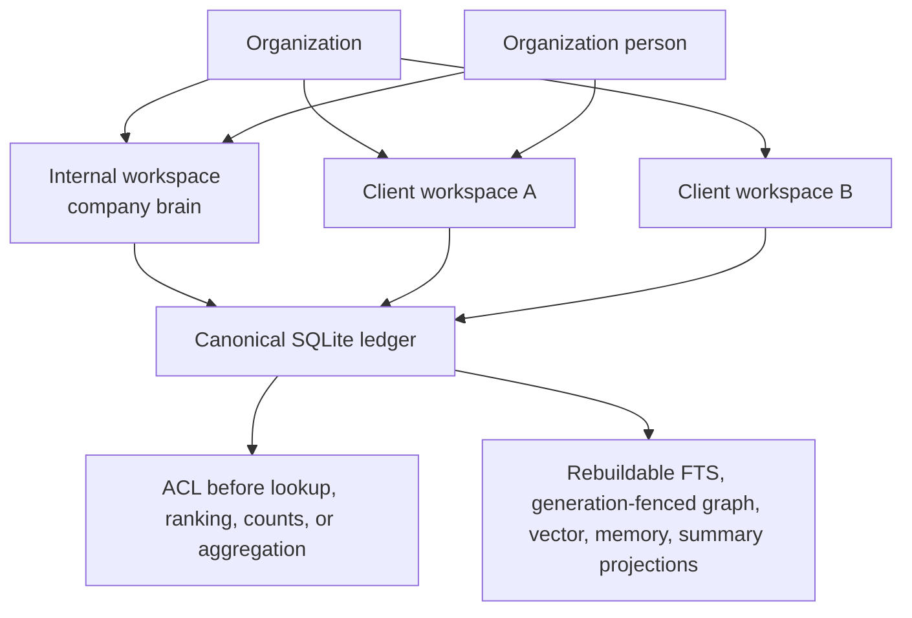
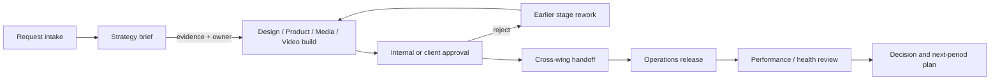
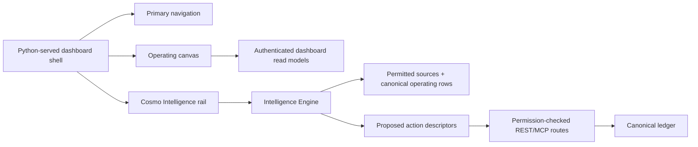
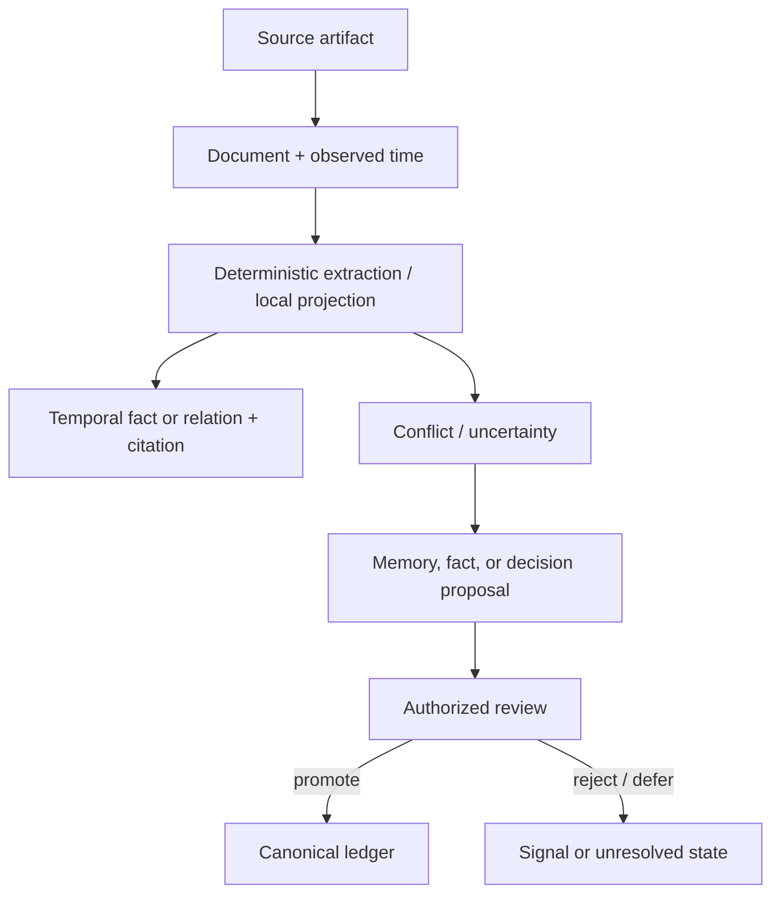
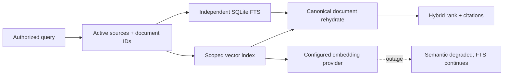
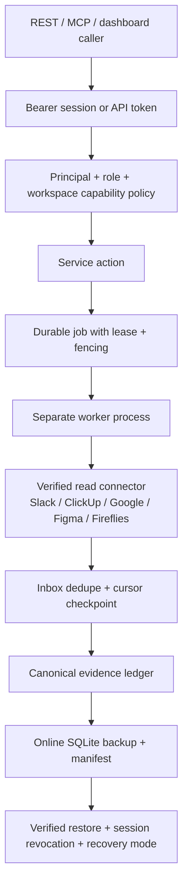
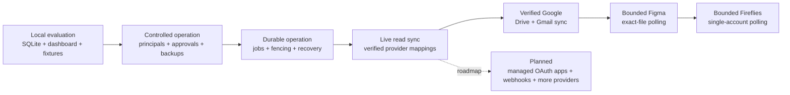

# Auremgrid Company OS

Auremgrid is a local-first operating system for an agency that needs one auditable place for client context, delivery work, approvals, evidence, and operating decisions. It uses an organization-scoped SQLite ledger as the canonical record and rebuildable local projections for search and analysis.

The product decision is simple: keep authority, permissions, provenance, and temporal history in a small system the agency can inspect and back up itself; connect external tools only through explicit, restart-safe adapters.

## Executive view

### The problem it addresses

Agency work is usually split across conversations, task boards, documents, design files, campaign tools, finance tools, and spreadsheets. That makes it hard to answer basic operating questions: what was promised, who owns the next step, which client can see a record, what evidence supports a claim, and what is waiting for approval.

### What Auremgrid changes

- A single organization and workspace boundary for people, clients, projects, work, decisions, evidence, and audit history.
- A temporal company brain: source documents, facts, relations, citations, conflicts, proposals, and signals remain distinguishable.
- Executable cross-wing workflows with dependencies, evidence gates, approvals, handoffs, SLAs, escalation, rework, and immutable run snapshots.
- Durable jobs and connector sync that can restart without silently advancing a cursor or claiming a provider is healthy when it is not.
- A modular local dashboard, REST API, MCP-style tools, CLI, and deterministic Intelligence service over the same policy and canonical ledger.

This is an operating control plane, not a replacement for every specialist tool. Slack, ClickUp, Google Drive, Gmail, explicitly mapped Figma files, and a single mapped Fireflies account have credential-backed read synchronization with provider verification, durable backfill, fenced workers, and lifecycle-aware evidence. Google OAuth is a generic fail-closed PKCE/vault lifecycle only: the repository ships no Google client credentials and performs no real token exchange unless an operator injects the provider transport and secrets. Figma polling is bounded to verified exact-file mappings; Fireflies polling is bounded to one verified account mapping. Read-only Stripe Billing/accounting and Meta Ads import adapters exist behind injected transports for deterministic imports, but they are not live registered connectors and do not send or mutate provider data. Intelligence outputs are read models: they cite visible evidence, explain uncertainty, and propose reversible next steps, but they do not silently execute work, approvals, connector writes, external sends, or report delivery.

## Who it serves—and who it does not

### Good fit

- Retainer or project agencies coordinating strategy, product, paid media, design, video, and operations across several client workspaces.
- Owners and operations leads who need explainable health, scope, risk, and delivery status rather than another unscoped task list.
- Teams that prefer local control, inspectable SQLite, explicit backups, and reversible connector integrations.
- Technical operators who can run a Python process and keep a durable database path available to the worker and backup process.

### Not the right first choice

- A team seeking a hosted CRM, a full accounting system, or a general-purpose project-management replacement.
- A company that requires managed multi-region availability, bundled production OAuth client registrations, email/report sends, or guaranteed unattended production operations today.
- A workload that needs high-volume event streaming or binary asset storage; Auremgrid records metadata, evidence, and links while asset backup remains a separate policy.

## Outcomes and use cases

| Operating question | Auremgrid outcome |
|---|---|
| “What is true for this client, and when was it true?” | Cited facts with observed time, validity windows, source permissions, and conflict history. |
| “What should happen next?” | Work items, dependencies, owners, forced review, and accountable notifications. |
| “Can this request move across several disciplines?” | Versioned workflow template, stage evidence, approval gate, handoff contract, SLA, and rework route. |
| “Are we drifting from the agreement?” | Contract allowances, scope usage, risks, opportunities, health explanations, and decision records. |
| “Can a worker or connector resume safely?” | Leased jobs, fencing, retries, dead letters, inbox dedupe, durable cursors, and explicit degraded state. |
| “Can an assistant change the company record?” | No silently: AI outputs enter as proposals/signals and promotion remains human or policy controlled. |

## Capability map

| Module | What it provides | Current status |
|---|---|---|
| Organization and identity | Organizations, internal/client workspaces, people, memberships, principals, sessions, API tokens, actor bindings | Implemented; deny-by-default policy |
| Company brain | Sources, documents, temporal facts, relations, citations, aliases, conflicts, history, proposals, knowledge health | Implemented; SQLite FTS5 and local projections |
| Client operations | Briefs, health explanations, risks, opportunities, contacts, relationships, meetings, conversations, unanswered requests | Implemented |
| Projects and delivery | Projects, work hierarchy, subtasks, dependencies, comments, files, versions, time entries, reviews, approvals, forced delivery stages | Implemented |
| Client portal | Client-role identities, bounded intake request front door with explicit staff accept/decline, client comments and decisions on client-kind reviews only | Implemented |
| Cross-wing workflows | Neutral templates, immutable definition versions/runs, readiness, evidence, gates, handoffs, SLAs, escalation, cancellation, rework | Implemented; eight representative templates |
| Campaigns and content | Campaigns, sourced metrics, creatives, content stages, performance snapshots | Implemented; values remain unknown/not connected until sourced |
| People and capacity | Skills, availability, leave, derived weekly workload/capacity by person, account, and wing | Implemented |
| Finance | Connection state, invoices, revenue, costs, budgets, software/AI cost records, client economics | Implemented schema and sourced records; never fabricates values |
| Agents and automations | Agent records, scoped roles, tasks, queues, runs, tool calls, outputs, costs, traces, training-mode automations | Implemented; unattended automation remains experimental |
| Integrations | Explicit mappings, external secret references, verification, sync runs, connector inbox/dedupe | Slack, ClickUp, Google Drive, Gmail, bounded exact-file Figma, and single-account Fireflies live read sync; Drive/Gmail use folder/drive and label mappings with redacted overlap quarantine; GitHub and other providers remain disabled catalog-only entries |
| Jobs, outbox, recovery | Atomic claims, leases, fencing, progress, retry/backoff, dead letters, cancellation, idempotency, append-only events, recovery mode | Implemented; outbound sends remain a future gate |
| Interfaces | Local dashboard, REST API, MCP-style router, CLI | Implemented; all policy remains service-side |
| Storage and projections | Versioned SQLite migrations, online backups, checksums, integrity/FK verification, restart-safe rebuilds | Implemented; external binary assets require separate backup |
| Feedback and learning | Record feedback, detect recurring patterns, promote preferences, approve/reject decisions | Implemented; pattern promotion requires configurable threshold |
| Performance insights | Anomaly detection, creative and channel comparisons, insight approval workflow | Implemented; insights require sourced metric snapshots |
| Forecasting | Revenue, client renewal, capacity, and utilization projections from recorded data | Implemented; projections are point-in-time and require historical data |
| Intelligence Engine | Workspace and portfolio briefs from permitted evidence, canonical operating records, situation/change/hypothesis/scenario/impact/recommendation fields, historical analogues, decision-to-outcome learning links, immutable expert/runbook contracts, bounded orchestration traces, recommendation learning, shadow evaluation safety, proactive attention lifecycle, and proposed action descriptors | Deterministic read-only intelligence with optional injected model-reasoning/specialist providers; malformed/unavailable providers fall back or degrade, and no provider can execute writes |
| Data lifecycle and retention | Retention policies, scoped deletion with allowlist, workspace export, deletion audit trail | Implemented; outbound archive/redact actions remain future |

### Capability and onboarding matrix

The status below is deliberately split by how a new operator can exercise a
capability. “End-to-end local” means it works against the local SQLite ledger
without a provider account. “Manual/sourced” means the ledger and API are
implemented, but an operator must enter or bind evidence; Auremgrid does not
invent the missing values. “Planned/not yet implemented” is not a supported
workflow in this release.

| Surface | End-to-end local | Manual/sourced boundary | Planned/not yet implemented |
|---|---|---|---|
| Organization, identity, workspaces, memberships, projects, work, reviews, approvals, workflows | Yes, including the local dashboard, REST, MCP-style tools, and CLI | Staff must create the real roster and records | Hosted auth and client self-service login |
| Company Brain, search, citations, proposals, conflicts, Intelligence | Yes with deterministic local projections, immutable expert/runbook definitions, bounded read-only orchestration, learning records, shadow evaluation telemetry, proactive snapshots, and human-gated proposals | Optional local model/Graphiti projections and strategic-reasoning/specialist adapters require already-installed or operator-injected providers and explicit configuration | Autonomous writes, unsupervised promotion, or live routing changes from evaluation telemetry |
| Sales pipeline | Yes for local prospects, proposals, append-only sales events, and idempotent proposal-to-client conversion | Proposal amounts and contract terms are operator-entered | CRM/provider sync, outbound proposal sending |
| Campaigns, creative, content | Yes for lifecycle, review, and immutable versions | Metrics and campaign pacing require manually imported or connector-sourced snapshots; pacing is `insufficient_data` without budget and spend | Ads-platform sync and outbound content publishing |
| Retainers and reports | Yes for retainer read-model calculations, internal report-pack approvals, and approved client-portal report versions | Revenue, costs, scope usage, and report runs must already be recorded; client report publication is portal-only and approval-gated | Email sends, ad/content publishing, or external report delivery |
| Finance | Local ledger and authenticated controls are implemented | An organization admin must connect a finance state first; every revenue, invoice, cost, budget, software-cost, and AI-usage-cost row requires a source. Client economics/profit/margin are derived only from those rows | Accounting-provider sync and fabricated/default metrics |
| Forecasts and capacity | Deterministic point-in-time forecasts from recorded contracts, revenue, and capacity snapshots | Historical data and correctly scoped workspace/contract dates are required | Guaranteed predictive accuracy or external planning-system sync |
| Integrations and jobs | Local mappings, verification state, generic fail-closed OAuth lifecycle records, durable jobs, leases, retries, fencing, redaction, and recovery | Credential references, provider verification, mapped streams, and worker execution are manual; supported read sync is Slack, ClickUp, Drive, Gmail, exact-file Figma, and one Fireflies account. Stripe Billing/accounting and Meta Ads have injected read-only import adapters, not live connector registrations | Bundled OAuth client credentials, public webhook ingestion routes, external sends, Google Ads/accounting live sync |
| Deployment and operations | Local evaluation and controlled single-host SQLite operation | Operators provide durable storage, backups, restore rehearsal, secret manager, private network, and reverse proxy/TLS for non-local access | Packaged production deployment, managed observability backend, multi-region service |

### Finance controls (exact boundary)

Finance is a connected-only sourced ledger, not an accounting integration. An
organization owner/admin sets the finance connection state; until then
`GET /finance` returns `not_connected` with null metrics and all finance writes
fail. After connection, a writable workspace member (or an organization
admin for organization-level rows) can record revenue, invoices, costs,
budgets, software costs, and AI usage costs, but each row must include a
non-empty source and valid dates/amounts. The read-only Stripe Billing/accounting
and Meta Ads adapters normalize injected provider pages into immutable
`provider_import_records` with cursor/quarantine metadata; they are testable
import adapters, not bundled live connector registrations, and they do not
write to Stripe, Meta, accounting, or ad platforms. `POST /finance/economics/calculate` derives client
revenue, labor, software, AI, and other cost, gross contribution/profit, and
margin for the requested period; it never estimates missing values.

The agency revenue operations layer adds local prospect/proposal records and
append-only sales events. `POST /sales/convert` is an idempotent, staff-authenticated
operation that creates a client workspace and contract from a proposal; it is
not a CRM sync or an externally sent proposal. Campaign budget pacing compares
the configured campaign budget with the latest sourced spend and reports
`insufficient_data` when either is absent. The retainer read model derives
recognized revenue, recorded costs, profit, margin, scope usage/utilization,
and a bounded renewal signal from existing contracts and usage rows. Report
packs have a request -> approve/reject -> `delivered_internal` lifecycle with an
append-only event history. A completed report run can also be published to the
client portal only after an approved `report.portal_publish` human approval;
portal versions are immutable, supersede prior report-type versions, and record
view/download/revoke events. There is still no email send, provider send, or
outbound report dispatch.

## How the system hangs together

### Company hierarchy and data isolation



People are organization-level identities. A person can span client workspaces, but every read and write is scoped through organization and workspace membership. Denied records are not disclosed through counts, ranking, or existence checks.

### Request-to-delivery cross-wing workflow



Each run snapshots the validated definition. Dependencies control readiness; stage order is the canonical presentation sequence. One-way gates require evidence and an approver, and rejected work records its route back.

### Dashboard and Intelligence surface



The dashboard is a zero-build local application served by the Python HTTP process. Its live shell is split into static assets under `src/auremgrid/api/dashboard`: `index.html`, CSS modules, JS modules, and small completion layers. It uses a three-zone desktop layout: grouped primary navigation, an operating canvas, and a permanent Cosmo Intelligence rail that becomes a drawer on narrower screens. Auremgrid is the product and operating system; Cosmo Intelligence is the named assistant inside it. The persisted backend key remains `cosmo`.

The interface specifies Gellix as its UI family and resolves it from the local machine so the repository does not redistribute a proprietary font. Install a licensed local Gellix family for exact typography; the CSS retains a generic sans-serif safety fallback when Gellix is unavailable.

The dashboard shell includes Command, Clients, Client HQ, Client Portal, Work board/list, Projects and deliverables, Review Center, Campaigns, Content, Creative, Brain, Meetings, People/Capacity, Finance, Agents, Automations, Reports, Integrations, and Settings surfaces. Those screens use authenticated backend endpoints and are designed to preserve honest empty, disconnected, degraded, and permission-denied states. Visible actions either invoke a canonical authenticated route or are disabled with the backend-reported reason; the UI does not imply unsupported mutations. Unknown finance, campaign, or connector values remain unknown until sourced. Client HQ read models cover explainable health, contract/scope consumption with period history, and auditable risk/opportunity lifecycles. Client Portal separates client requests and deliverable decisions from staff triage. Work capture records project, owner, priority, estimate, tags, brief, approved context, deadline, and financial value; transitions use server-granted legal transitions, optimistic versions, scoped idempotency, history, and permission checks. Campaign, content, and creative inspectors expose their legal lifecycle actions, immutable creative versions, review history, and sourced performance; outbound publishing remains explicitly disconnected. Finance can be connected by an organization administrator and records sourced revenue and invoices without inventing values. Integration onboarding stores only server-side environment references, never raw credentials. Agent task, claim, run, and detail views are fenced to the caller's visible workspaces and backed by scoped tasks, tool calls, traces, outputs, failures, and costs.

The Intelligence rail calls `GET /dashboard/intelligence`; the Command overview also calls `GET /dashboard/intelligence/executive`. The engine composes permitted evidence and canonical operating records into findings with situation, changes, hypotheses, supporting/opposing evidence, scenarios, impact, recommendation, confidence, uncertainty, historical analogues, and decision-to-workflow-outcome-learning links where available. Expanded scenarios retain explicit new-client, staffing, leave, client economics, and keep/drop inputs without inventing missing values. Portfolio reads add ACL-scoped cross-workspace analogues and the executive brief ranks a sourced top-three narrative.

Schema 42 adds immutable ExpertProfile and IntelligenceRunbook definitions. The default pack contains 13 compact expert profiles and 12 runbooks with required evidence, allowed domains/tools, activation sequences, quality gates, contradiction/scenario policies, stop conditions, and output contracts. The dashboard, REST API, and MCP tools can list/get those definitions through normal workspace access checks. `POST /dashboard/intelligence/orchestrator/run` performs a bounded, read-only expert review over the already-scoped Intelligence projection. It returns a `trace_id`, selected runbook, contributing profiles, trace stages, contradictions, limits, degraded status, and a validated recommendation object. Orchestration runs do not create facts, execute recommendations, enqueue jobs, or publish outputs.

Schema 43 adds append-only Intelligence learning records. Hypotheses remain interpretations with supporting and opposing evidence refs, assumptions, status, confidence, and optional supersession/outcome fields; they are not canonical facts. Recommendations persist runbook/profile contributors, options, a recommended option, evidence refs, an evaluation window, and lifecycle events for accepted, rejected, chosen, and evaluated outcomes. Evaluation requires measured outcomes inside the recommendation window with matching workspace-scoped evidence. Idempotency keys prevent duplicate writes and conflicting replay.

Schema 44 adds shadow-only evaluation safety. Evaluation runs record provider/model/profile/runbook metadata, latency, token/cost caps, evidence completeness, evaluator and human acceptance scores, revision counts, downstream outcome score, and capped/failed circuit events. Circuit breakers can block further evaluation starts for a task class, but this layer never changes agent routing or selects a live execution path.

These are read projections or append-only learning/evaluation records. A capability-gated refresh request can enqueue a durable `proactive_intelligence.refresh` job; the worker persists an immutable, per-person snapshot and attention queue for the dashboard. Schema 45 adds a deduped proactive attention lifecycle with `new`, `acknowledged`, `acted_on`, `resolved`, `dismissed`, and `resurfaced` states, preserving the originating snapshot, attention item, orchestration trace, recommendation id, safe action descriptor, and optional approval request. `acted_on` is available only after the referenced approval is current, approved, and scoped to the same organization/workspace/person. The UI distinguishes `no snapshot`, `queued`, `running`, `failed`, `stale`, and `ready`; enqueueing never falsely claims that a worker has started. `GET /dashboard/intelligence/refresh-status` reports the latest job/snapshot plus the exact local worker command when operator action is needed. Manual refreshes create a fresh job, callers can supply an explicit idempotency key when they need request deduplication, unchanged projections do not append records, and later changed projections create a new version. Persisted refreshes use deterministic local reasoning and write no external action. Live reads may use an explicitly injected strategic-reasoning provider to add validated hypotheses, options, scenarios, recommendation, confidence, and dissent; it receives only the already ACL-scoped context, stores only hashed/redacted run metadata, and falls back to deterministic review on provider failure or malformed output. Suggested operations are returned as descriptors for canonical routes such as work capture, decision creation, and approval request; they require the caller's normal capability checks and, where applicable, explicit human approval.

For a concrete JSON model endpoint outside tests, set `AUREMGRID_REASONING_ENDPOINT` and optionally `AUREMGRID_REASONING_MODEL`, `AUREMGRID_REASONING_VERSION`, `AUREMGRID_REASONING_API_KEY_ENV`, and `AUREMGRID_REASONING_TIMEOUT`. An absent endpoint keeps the deterministic offline path; an explicitly present but invalid configuration fails startup rather than silently pretending the provider is offline.

### Evidence, knowledge, and proposals



Source text is evidence, not executable instruction. AI-generated output is not silently promoted into canonical truth.

### Semantic retrieval (schema 16)



The default provider is a deterministic, offline lexical fallback so a new installation works without model files or network access. Its health explicitly reports `fallback_used=true`. Schema 16 stores rebuildable float32 vectors in `document_embedding_projection`, scoped by workspace, document, provider, model, version, and dimensions. Retrieval authorizes active source/document IDs before either channel runs; semantic candidates are never gated by an FTS hit and are rehydrated from canonical SQLite rows before ranking. An opted-in provider outage is reported as `semantic=degraded` with `fallback_used=false` while cited FTS evidence and startup remain available.

For a local SentenceTransformers model, install the optional dependency with `pip install -e ".[semantic]"`, then pass `--semantic-model-path`, `--semantic-model`, and `--semantic-version` to each long-running command. The path must already be a model directory; loading is lazy and uses `local_files_only=True`, so the application never downloads weights. The same values can be set locally as `AUREMGRID_SEMANTIC_MODEL_PATH`, `AUREMGRID_SEMANTIC_MODEL`, and `AUREMGRID_SEMANTIC_VERSION`. Keep all server and worker processes on the same explicit identity/version. Changing either version or dimensions rebuilds the disposable projection under the new contract; verify semantic health before relying on vector results.

Graph projection uses the same boundary: the dependency-free local temporal graph is the default, is rebuildable, and schema 17 records building/active/failed generations. A real Graphiti/Neo4j adapter is opt-in only (`pip install -e ".[graphiti]"` plus explicit `AUREMGRID_GRAPHITI_*` settings); it requires configured OpenAI-compatible LLM and embedder endpoints and never silently claims to be connected. Upstream reads are permitted only when the actor has full workspace source access; partial ACL scopes skip the upstream channel while canonical, FTS, and semantic retrieval continue. Every remote result is mapped through schema 21's append-only canonical episode-key/provider-UUID sidecar and rehydrated from canonical SQLite evidence. Rebuilds stage a generation before SQLite activates it; restart restores complete mappings without rewriting remote episodes and rebuilds incomplete generations from canonical evidence. Failures leave the last verified generation available and mark only graph health degraded/unavailable; health output is sanitized.

### Entity resolution and knowledge states (schema 18)

Entity matching is a proposal workflow, not an automatic merge. `GET /entity/candidates` and MCP `brain.entity.candidates` can suggest deterministic name/domain variants only when the caller can see the supporting source evidence; discovery writes nothing. Candidate aliases and merges are scoped to one organization/workspace and remain pending until an identity with `brain_promote` records an immutable decision. A merge creates a one-way redirect while preserving the original entity, alias owner, evidence, and decision history; alias lifecycle changes are append-only state events. Ordinary extracted facts begin as `inferred`; an exceptional extraction confidence of at least 0.95 is explicitly `high_confidence`, while human promotion remains `verified`. Incompatible observations remain together with both citations in a conflict group, and a later human resolution appends `verified`/`stale` events without deleting history. Current search and health use the latest effective state; historical `as_of` queries can still inspect prior states. A scoped service/agent identity may propose but cannot promote, and cross-workspace candidates are rejected without disclosure.

### Capability-level routing (schema 19)

Agent work is classified into four provider-neutral capability levels. Tasks persist their intent tags, recommended level, selected level, and any explicit escalation reason. Existing agent identities are upgraded without changing their IDs, under-leveled assignments and de-escalation are rejected, and every override is recorded in an immutable audit table. Business titles and organization permissions remain separate from these execution levels.

### Client account rosters (schema 20)

Each client workspace can keep immutable, effective-dated account rosters for the client-success DRI and backup, account and wing leads/executives, cadence and escalation owners, and default meeting facilitator/note-taker. These business assignments never grant system permissions. New workflow runs resolve eligible roster roles once and snapshot the selected people and roster version; later roster changes affect only new runs. Meeting responsibility changes are append-only and historical reads remain available through `as_of`.

The Client HQ view projects that roster into explicit accountability slots, meeting ownership, workload, and workflow readiness. Weekly capacity is derived at read time from canonical availability, approved leave, recorded time, remaining work estimates, and immutable workflow-stage estimates; it never treats a stale capacity snapshot as operational truth. Account demand and wing demand remain separate views so the system does not invent an allocation of a person's availability across clients.

### Authentication, jobs, connectors, and recovery



Credentials are externally referenced and resolved only inside authorized execution. Hashes/fingerprints and sanitized metadata may be recorded; secret values and authorization headers are not.

### Rollout maturity



The last line is a roadmap, not a current capability claim. The current OAuth
surface is generic and fail-closed; it does not bundle provider app
registrations, token-exchange transports, or customer account installation.

## Requirements

### Minimum for a local evaluation

- Windows, macOS, or Linux with a supported 64-bit Python 3.12+ runtime.
- SQLite built with FTS5 (the standard Python SQLite build normally includes it).
- Unverified evaluation estimate: 2 CPU cores, 4 GB RAM, and 1 GB free disk for the synthetic demo and tests. Measure your own workload before production use.
- A durable writable path for the SQLite file; no Docker, Node, API key, or network service is required for the offline path.

### Recommended for a small agency deployment

- 4 CPU cores, 8–16 GB RAM, SSD storage, and a filesystem with reliable locking and scheduled snapshots.
- Separate web and worker processes using the same durable database path.
- A secret manager or environment-backed secret store, plus an independent backup destination and restore rehearsal.
- Restrict the listening interface to localhost or a private network until a reverse proxy, TLS, and operational access policy are in place.

## Setup: clone to a working local system

```text
git clone <repository-url>
cd Auremgrid-Company-OS
python scripts/auremgrid.py --help
```

### Activate a real agency in one command

Use a new database for the agency's first setup. This command creates the
agency, its first workspace, the owner account and permissions, the legacy
Brain actor binding, and a seven-day dashboard session together:

```text
python scripts/auremgrid.py setup-agency --db "C:\data\agency.sqlite" --agency "Northwind Studio" --admin-name "Nora Owner" --admin-email "nora@northwind.example"
```

The command prints a setup receipt. Copy `session.token` immediately: it is a
temporary login key proving who the browser is and what it may access. Auremgrid
stores only a one-way digest, so the original token cannot be recovered later.
It is not an API key for an AI provider and it is not shared across the agency.

Then start Auremgrid with the same database:

```text
python scripts/auremgrid.py serve --host 127.0.0.1 --port 8791 --db "C:\data\agency.sqlite"
```

Open `http://127.0.0.1:8791/`, choose **Connect to Auremgrid**, and paste the
token. The browser keeps it only in that browser profile. Use **Sign out** before
leaving a shared device. If it expires or is revoked, an administrator issues a
new session; the old plaintext value is never recoverable from the database.

For first-run data, use the CSV preview-and-commit path rather than local
folder ingestion. Print templates, review a dry run, then explicitly commit the
approved batch:

```text
python scripts/auremgrid.py import-templates --db "C:\data\agency.sqlite"
type clients.csv | python scripts/auremgrid.py import-preview --db "C:\data\agency.sqlite" --organization org_northwind_studio --person person_nora --type client_workspaces --idempotency-key clients-preview-001
type campaigns.csv | python scripts/auremgrid.py import-preview --db "C:\data\agency.sqlite" --organization org_northwind_studio --workspace ws_northwind_studio --person person_nora --type campaigns --idempotency-key campaigns-preview-001
python scripts/auremgrid.py import-commit --db "C:\data\agency.sqlite" --organization org_northwind_studio --person person_nora --batch import_batch_id --idempotency-key campaigns-commit-001
```

Previews write durable batch, row, error, and receipt records but do not create
canonical business records. Commit retries with the same idempotency key replay
the existing receipt; invalid rows remain quarantined.

For a real team, create a separate person/principal/session for every operator.
Never share the owner's token. Keep the service on localhost or a private
network until it is behind HTTPS, a trusted reverse proxy, backups, a secret
manager, and an explicit access policy. API tokens are for scoped integrations;
human operators should use sessions.

## First-run sequence for a real agency

Complete these steps in order. The sequence creates authority before data and
proves recovery before any external connector is allowed to run.

1. **Organization, owner, and auth.** Run `setup-agency` to create the
   organization, internal workspace, owner person, memberships, principal, and
   one-time local session. Start `serve`, connect the browser with that token,
   then issue one separate session per operator. Use `bootstrap-auth` only for
   an existing database whose identity and actor bindings are already present.
2. **CSV setup imports.** Use `import-templates`, `import-preview`, and
   `import-commit` for client workspaces, campaigns, and campaign metrics.
   Review quarantined rows before committing; uploads accept CSV content, not
   local filesystem paths.
3. **Client workspace.** Create each remaining client workspace and associate it with the
   organization. Keep the internal workspace separate from client workspaces;
   ACLs apply before lookup, counts, ranking, and aggregation.
4. **Membership and roster.** Add people to the organization and only the
   workspaces they may access. Record client account-roster roles and meeting
   responsibilities before assigning delivery work.
5. **Project and workflow.** Create a project, work items, owners, dates, and
   approved context. Start a versioned workflow run, satisfy evidence gates,
   and use the review/approval routes for one-way decisions.
6. **Finance and manual records.** An organization admin connects the finance
   state. Enter sourced revenue, invoices, costs, budgets, software costs, AI
   usage costs, and (when inputs are complete) calculate client economics. Add
   prospects/proposals, campaign budgets/metrics, retainer allowances, and
   internal report-pack requests only from real or clearly labelled fixture
   evidence; no values are inferred.
7. **Backup rehearsal.** Run `backup` and `verify-backup`, inspect the manifest,
   and rehearse an offline restore to a separate destination. Keep the service
   in recovery mode until a human has reviewed pending jobs and outbound state.
8. **Integrations.** Store only environment/secret references, verify one
   provider mapping at a time, and enqueue a read-sync job with a durable
   worker. Start with a private/local bind and confirm redaction, cursors,
   fencing, and degraded states before adding another connector.
9. **Operate and review.** Schedule online backups and a separate worker,
   review report-pack approvals and finance sources, and keep unsupported sends,
   provider syncs, and hosted-login expectations outside the operating process.

## Dashboard preview


The image above is a deterministic SAMPLE DATA preview for GitHub. It is not
embedded in the production dashboard and does not come from a customer
database. It is generated only when the checked-in SVG already contains the
expected `SAMPLE DATA`, `sample.invalid`, `Ledger healthy`, and `Not connected`
markers. To view the actual interactive dashboard locally, create a seeded
evaluation database, issue a local session token, start the server, then open
`http://127.0.0.1:8791/`:

```text
python scripts/auremgrid.py demo --db "C:\data\auremgrid-demo.sqlite"
python scripts/auremgrid.py bootstrap-auth --db "C:\data\auremgrid-demo.sqlite" --organization org_demo --person person_demo_owner --email owner@demo.invalid --workspace ws_alpha --actor act_alpha_admin
python scripts/auremgrid.py serve --host 127.0.0.1 --port 8791 --db "C:\data\auremgrid-demo.sqlite"
```

For a richer three-client agency walkthrough (Prime Clinics, BASE Ryder, and
Evolve), use the isolated scenario seeder. It adds six
linked projects plus delivery, review, campaign, creative, capacity, risk,
decision, and Intelligence evidence records; all metrics are marked
`demo_fixture`, and finance remains disconnected:

```text
python scripts/auremgrid.py demo-agency --db "C:\data\auremgrid-agency.sqlite"
```

To add the same scenario to the standard localhost demo—and keep the existing
Demo Owner session scoped to it—seed the existing organization explicitly:

```text
python scripts/auremgrid.py demo-agency --db "auremgrid-demo.sqlite" --organization org_demo --owner person_demo_owner
```

The scenario currently contains 6 projects, 12 mixed-state work items, 9
reviews, 9 risks, 3 campaigns, 6 creatives, and 3 measured content items. It
also includes meetings, conversations, messages, touchpoints, signals,
opportunities, proposed feedback preferences, client intake, Sol/Terra/Luna
agent runs, a training-mode automation, a weekly report, a capacity forecast,
retention policy, and an intentionally disconnected ClickUp configuration.
Finance and provider connectivity remain explicitly disconnected. Running the
command again upgrades missing fixture evidence without duplicating records.

The launcher is the zero-install path: it runs directly from this trusted
checkout, does not change directory, install packages, or contact a network.
Use an explicit absolute database path when operating outside the repository:

```text
python scripts/auremgrid.py demo --db C:\data\auremgrid-demo.sqlite
python scripts/auremgrid.py bootstrap-auth --db C:\data\auremgrid-demo.sqlite --organization org_demo --person person_demo_owner --email owner@demo.invalid --workspace ws_alpha --actor act_alpha_admin
```

Optional editable installation requires Python 3.12+, a local setuptools 68+
build backend, and (for offline use) disabled build isolation:

```text
python -m pip install --no-build-isolation --no-deps -e .
```
Do not run installation from an untrusted checkout.

Run the offline verification suite:

```text
.\tools\test.ps1                 # PowerShell
python -m unittest discover -s tests
```

Run the deterministic real-browser dashboard gate when changing UI or API wiring:

```text
python -m pip install --no-build-isolation -e ".[browser]"
.\tools\run-dashboard-browser.ps1 -InstallChromium
```

The browser harness starts an isolated in-memory server on an available local port, seeds realistic agency workspaces, injects the session only into browser storage, and verifies authentication, workspace isolation, project and work creation, person assignment, board/list behavior, status transitions, review decisions, content lifecycle, Client Portal intake, integration onboarding, agent operations, inspectors, comments, Cosmo Intelligence, disconnected states, scroll regions, tile geometry, and responsive widths. It never places the token in a URL, screenshot, or log. Normal `unittest` discovery skips this optional gate cleanly when Playwright is not installed; the dedicated script fails with an actionable dependency message.

For a blank agency database instead of the synthetic demo, create the agency,
copy the one-time `session.token`, and then start the loopback server:

```text
python scripts/auremgrid.py setup-agency --db "C:\data\agency.sqlite" --agency "Northwind Studio" --admin-name "Nora Owner" --admin-email "nora@northwind.example"
python scripts/auremgrid.py serve --host 127.0.0.1 --port 8791 --db "C:\data\agency.sqlite"
```

The server prints `listening on http://127.0.0.1:8791`. Open `http://127.0.0.1:8791/` or `http://127.0.0.1:8791/dashboard`; both serve the same dashboard shell. The default bind is loopback. If you put the dashboard on any non-local network, TLS termination, reverse proxy access policy, firewalling, backups, restore rehearsal, and secret handling are operator responsibilities; see `deploy/Caddyfile` and `deploy/docker-compose.yml` as templates, not managed production hosting. The shell and `/dashboard-assets/*` load without a token, but all JSON data routes except `/health`, `/metrics`, and `/health/detailed` require bearer authentication.

The bootstrap command prints the session token once. The dashboard opens an in-page **Connect to Auremgrid** dialog where you enter that token; it then calls `/auth/me`, `/dashboard/data`, `/dashboard/settings`, `/dashboard/brain`, `/dashboard/intelligence`, and the other permitted module endpoints with `Authorization: Bearer <token>`. `setup-agency` is the recommended first-run path. Use `bootstrap-auth` only when the organization, person, membership, workspace, and actor binding targets already exist:

```text
python scripts/auremgrid.py bootstrap-auth --db "C:\data\agency.sqlite" --organization <organization-id> --person <person-id> --email owner@example.invalid --workspace <workspace-id> --actor <legacy-actor-id>
```

The token is not recoverable from the database. The dashboard stores the supplied value in browser `localStorage`, so use it only on a trusted machine and browser profile. Do not put it in screenshots, chat, tickets, source control, URLs, or shared documents. Use the dashboard's **Sign out** control when finished. API clients can keep a scoped API token in a secret manager or environment variable. Run one durable job in a separate process:

```text
python scripts/auremgrid.py worker-once --db "C:\data\agency.sqlite" --organization <organization-id> --workspace <workspace-id> --worker-id local-worker-1
python scripts/auremgrid.py worker-loop --db "C:\data\agency.sqlite" --organization <organization-id> --worker-id local-worker-loop
```

Create and verify an online backup without copying a live WAL file:

```text
python scripts/auremgrid.py backup --db "C:\data\agency.sqlite" --output "C:\data\backups\agency.sqlite"
python scripts/auremgrid.py verify-backup --backup "C:\data\backups\agency.sqlite"
```

Restore is intentionally an explicit offline operation and requires the verified backup plus `--overwrite` when replacing an existing destination.

## First 30 minutes

1. **Minutes 0–5 — Start the seeded system.** Run `demo`, `bootstrap-auth`, and `serve` as shown above; open the dashboard and inspect the internal workspace plus two synthetic client workspaces.
2. **Minutes 5–10 — Read the brain.** Use the search box and client brief to inspect a cited result, its source, and the distinction between known and unknown information.
3. **Minutes 10–15 — Inspect delivery control.** Open a project and its work/review records in the dashboard. Available controls are capability-gated and call the same authenticated backend routes; unsupported or read-only states remain explicit.
4. **Minutes 15–20 — Inspect a workflow.** Use the workflow REST/MCP endpoints to list the neutral templates, create a `landing_page` or `campaign_launch` run, start a ready stage, attach evidence, and then return to the dashboard to see the canonical stage board. Brain shows pending proposals, unresolved conflicts, current truths, and semantic/graph health. Where the authenticated row exposes `allowed_actions`, the dashboard offers capability-gated confirmation actions with idempotent descriptors; historical rows expose no controls.
5. **Minutes 20–25 — Inspect control surfaces.** Visit people/capacity, finance, integrations, jobs, and activity. `not_connected` and unknown values are intentional when no source is configured.
6. **Minutes 25–30 — Exercise recovery.** Run `backup` and `verify-backup`, inspect the manifest, and review [jobs and recovery](docs/jobs-and-recovery.md) before connecting any external provider.

## API and MCP examples

The examples below use placeholders, not real credentials. All JSON and data routes except `/health` require a bearer session or API token. The unauthenticated `/` and `/dashboard` routes serve only the static shell; its data requests still require the token. The server derives identity from the credential, so caller-supplied person, actor, and organization values cannot impersonate another principal.

Health check:

```http
GET /health HTTP/1.1
Host: 127.0.0.1:8791
```

Authenticated identity:

```text
curl http://127.0.0.1:8791/auth/me \
  -H "Authorization: Bearer ${AUREMGRID_SESSION_TOKEN}"
```

Create an idempotent workflow run:

```text
curl -X POST http://127.0.0.1:8791/workflows/runs \
  -H "Authorization: Bearer ${AUREMGRID_SESSION_TOKEN}" \
  -H "Content-Type: application/json" \
  -d '{"organization_id":"<org>","workspace_id":"<workspace>","template_id":"landing_page","idempotency_key":"demo-run-001"}'
```

The MCP-style interface exposes the same service policy through namespaced tools, for example:

```json
{
  "name": "workflows.templates",
  "arguments": {"organization_id": "<org>", "wing": "Design"}
}
```

See [REST API reference](docs/api-reference.md) and [MCP tools](docs/mcp-reference.md) for route/tool coverage and capability requirements.

The revenue-operations HTTP routes are `/sales/prospects`,
`/sales/proposals`, and idempotent `/sales/convert`; read-only derived views
are `/campaigns/budget-pacing`, `/client-hq/retainer`, and `/report-packs`.
Internal report-pack actions are `POST /report-packs`,
`/report-packs/approve`, and `/report-packs/deliver-internal`. Finance controls
are `/finance`, `/finance/connect`, `/finance/revenue`, `/finance/invoices`,
`/finance/costs`, `/finance/budgets`, `/finance/software-costs`,
`/finance/ai-usage-costs`, and `/finance/economics/calculate`; all are
authenticated and finance writes require the connected state and a source.

## Deployment modes

### Local evaluation

One Python process serves the modular dashboard/API over localhost and uses SQLite. Synthetic fixtures and simulated connectors keep the path offline. The Intelligence Engine works in this mode from canonical demo records, permitted Brain evidence, and deterministic projections; optional semantic or graph providers can degrade without preventing the dashboard from starting.

### Controlled single-host operation

Run the web process and `worker-once` jobs as separate processes against a durable SQLite file. Use filesystem permissions, a private bind address, scheduled online backups, and a tested restore destination. This is the intended current operating mode for a small agency.

### External-provider read sync

Bind an external environment reference, verify the provider account and mapped streams, then enqueue a `connector.sync` job. Slack, ClickUp, Google Drive, Gmail, explicitly mapped Figma files, and a single mapped Fireflies account are supported for read synchronization. Figma is bounded to verified `file:<key>` mappings: a fetched, version-fenced file snapshot can retain bounded frame/section evidence, but its parent file is the only lifecycle and object-count record. It does not synchronize review or approval workflows or auto-create deliverables, reviews, or tasks. Fireflies is bounded to exactly one verified `account:<id>` mapping and polls transcripts by a durable date cursor, emitting one sanitized, bounded transcript event per meeting. The worker resolves the secret at execution time and records sanitized state only.

### CI and development

Run the unittest suite with synthetic fixtures and injected connector transports. No private accounts or network access are needed. Networked semantic engines, upstream graph providers, strategic-reasoning providers, and unattended automations remain optional/experimental.

## Security and trust boundaries

- Organization membership and workspace membership are checked before retrieval, ranking, aggregation, counts, or existence disclosure.
- Sessions and API tokens are opaque; only hashes are stored. API-token scopes narrow role capabilities. Workspace viewer cannot write.
- External secrets are references/fingerprints. They are resolved only inside authorized connector/job execution and recursively redacted from payloads, evidence, jobs, outbox records, and errors.
- Source evidence is untrusted data and cannot issue instructions. Extracted uncertainty becomes a proposal or signal; canonical facts are append-only observations with provenance.
- Durable jobs use atomic claims, leases, retries, dead-letter state, idempotency, and fencing. A stale worker cannot complete a reclaimed job.
- Restore revokes sessions, recovers in-flight jobs, enables recovery mode, and disables outbound dispatch until a human exits recovery mode.
- The current HTTP server is a local standard-library server. Put a reverse proxy/TLS/access policy in front of any non-local deployment; production hardening is not claimed by this repository.

## Verified evidence and release discipline

The authoritative release matrix is [release verification](docs/release-verification.md). It tracks isolation, persistence, permissions, workflow gates, projection rebuilds, migration-forward behavior, job fencing, credential redaction, backup verification, dashboard behavior, and live connector sync safety, including bounded exact-file Figma polling.

Before a release or schema change, run:

```text
.\tools\test.ps1
python -m compileall -q src tests
python -m auremgrid.cli evaluate-intelligence
git diff --check
```

The offline Intelligence contract evaluation can be run independently and is
intended for release evidence:

```text
python -m auremgrid.cli evaluate-intelligence
```

The dashboard showcase asset has its own non-fabrication check:

```text
python scripts/dashboard_showcase_svg.py
```

It checks ACL-scoped citations, uncertainty, structured optional reasoning,
approval descriptors, no unauthorized actions, deterministic provider
fallback, and the schema-42-to-45 Intelligence completion surfaces. See
[AutoGPT adoption decision](docs/autogpt-adoption.md) for the clean-room
architecture and licensing decision.

The offline suite must not require Docker, provider credentials, a private vault, or network access. Live provider tests use deterministic injected transports; they do not claim that a customer account was connected.

## Current limitations and roadmap

- Generic OAuth/PKCE lifecycle tables and routes exist, but they fail closed
  without `AUREMGRID_DEPLOYMENT_KEY`, an allowlisted redirect, operator-owned
  OAuth client credentials, and an injected token-exchange transport. The repo
  does not bundle Google client credentials or provide a managed installation
  callback. Public webhook ingestion and refresh-token rotation remain outside
  the packaged demo.
- Finance has no bundled live accounting-provider or advertising-provider sync.
  Revenue, invoices, costs, budgets, software costs, and AI usage costs are
  connected-only sourced records entered through authenticated controls.
  Injected read-only Stripe Billing/accounting and Meta Ads import adapters can
  normalize provider pages into immutable import records, but they are not live
  connector registrations. Client economics, profit, and margin are derived
  read models, not accounting truth.
- Prospect/proposal conversion, campaign budget pacing, retainer read models,
  forecast generation, and report-pack approval history are local ledger
  operations. Client report publication is portal-first and approval-gated;
  no email send, client-facing external dispatch, or outbound content publishing
  exists.
- There is no hosted auth, client self-service login, packaged production
  deployment, or managed observability backend. CSV setup imports are
  preview-first and commit-gated, not a hosted self-service portal. The
  standard-library server and SQLite are intended for local/private or
  controlled single-host operation only.
- Google Drive bootstraps from a captured changes token, walks mapped folders/shared drives through durable continuation tasks, reconciles parent chains and descendants after moves, and retires objects only after ancestry is resolved. Gmail captures a history baseline before label backfill and maintains label membership lifecycle. Objects that match mappings owned by different workspaces create an organization-level redacted quarantine, block cursor promotion, and write no workspace evidence.
- Figma supports verified, exact-file read polling with `current_user:read`, `file_metadata:read`, and `file_content:read`. A version-fenced file snapshot can retain bounded frame/section evidence; with explicit, proven `file_versions:read`, a changed file can also retain one bounded page of named-version evidence, and with explicit, proven `comments:read`, bounded comment evidence. The parent file remains the only lifecycle and object-count record. Review/approval workflows and auto-created deliverables, reviews, or tasks are out of scope. Fireflies supports verified, single-account read polling with `transcripts:read`, bounded to exactly one `account:<id>` mapping; it emits one sanitized, bounded transcript event per meeting from a durable date cursor and has no delete/tombstone signal. GitHub, advertising, and accounting systems remain disabled catalog entries only and do not report connected.
- The Intelligence Engine is an evidence-backed read model. It can surface cross-domain relationships, hypotheses, parameterized what-if scenarios, proposed cross-wing plans, historical analogues, and decision/outcome/learning links from available records. Optional model-backed strategic reasoning is provider-injected, ACL-scoped, schema-validated, auditable without raw prompts/outputs, and read-only; it is not an autonomous execution path.
- Expert orchestration, recommendation learning, shadow evaluation safety, and proactive attention lifecycle are local service/API/MCP surfaces. They do not provide a hosted model marketplace, autonomous specialist execution, production workflow routing changes, or external action execution. Safe action descriptors still bridge to existing canonical routes and, where required, approved human approval records.
- Unattended automations, remote semantic providers, upstream OSS engines, and externally visible sends remain experimental or future gates. Local semantic retrieval and its deterministic fallback are available behind the provider/index boundary described above.
- SQLite is local-first, not a multi-region distributed database. External binary assets require a separate backup policy.
- The standard-library HTTP server is appropriate for local/private operation; hardened public deployment needs an explicit reverse proxy, TLS, and access review.

The next safe increments are OAuth/PKCE with a write-capable secret backend, webhooks and multiple provider installations, a transactional outbox boundary for externally visible sends, richer provider adapters for the existing strategic-reasoning boundary, and continued rehearsal of the asset backup policy.

## Documentation map

- [Architecture](docs/architecture.md)
- [Domain model](docs/domain-model.md)
- [Operating model](docs/operating-model.md)
- [Wing workflow catalog](docs/wing-workflows.md)
- [Authentication and capabilities](docs/authentication.md)
- [Jobs, outbox, and recovery](docs/jobs-and-recovery.md)
- [Live connector synchronization](docs/live-connectors.md)
- [Data lifecycle](docs/data-lifecycle.md)
- [Permission model](docs/permission-model.md)
- [Threat model](docs/threat-model.md)
- [Dashboard architecture](docs/dashboard-architecture.md)
- [Agent model](docs/agent-model.md)
- [Finance model](docs/finance-model.md)
- [Connector model](docs/connector-model.md)
- [REST API](docs/api-reference.md)
- [MCP tools](docs/mcp-reference.md)
- [Upgrade guide](docs/upgrade-guide.md)
- [Release verification](docs/release-verification.md)
- [AutoGPT adoption decision](docs/autogpt-adoption.md)

Fixtures are synthetic. Never commit private client, employee, credential, or financial data.

Apache-2.0.
