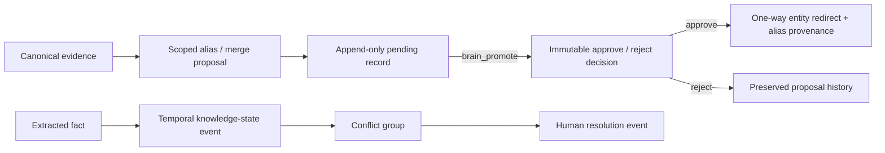

# Architecture

## Agency-scale organization model

Organization is the tenant boundary. Internal and client workspaces sit beneath it; people are organization-level identities joined to any number of workspaces. The SQLite ledger uses ordered migrations. Delivery, client operations, agency systems, agents, automations, integrations, and reports all share that boundary.

Disposable projections rebuild at process start from canonical documents, facts, and memories. Schema 16 adds a durable, rebuildable float32 document embedding projection and workspace-scoped vector index; schema 17 adds fenced graph projection generations; schema 18 adds append-only entity-resolution proposals/decisions, alias lifecycle events, and temporal knowledge-state events; schema 19 adds provider-neutral agent capability levels, task routing metadata, and immutable escalation audits; schema 20 adds immutable, effective-dated client account rosters and meeting responsibility events. The offline embedding implementation is explicitly a deterministic lexical fallback. A local SentenceTransformers provider is an opt-in projection adapter: its dependency and model load lazily, only an existing local directory is accepted, and its explicit provider/model/version/dimensions identity fences vector reads. Health distinguishes the intentional fallback from an unavailable configured provider; local-provider failures degrade only the semantic channel and never silently switch identity or block canonical/FTS operation.

Auremgrid is built around an evidence ledger. Documents enter from sources, facts and relations are extracted into append-only observations, and query results return evidence bundles with citations.

## Core Rules

1. No global context: every operation needs workspace_id and actor_id.
2. ACL first: inaccessible sources are removed before search, scoring, or graph expansion.
3. Append-only truth: new observations never silently overwrite old observations.
4. Provenance required: every document and fact carries source id, locator, hash, and timestamps.
5. Agent access is read-only by default; a scoped service identity may propose a candidate, but promotion always requires the separate brain_promote capability.

Entity resolution is deliberately human-gated:

## operating layer

The evidence ledger is not the whole product. agency work also needs first-class contracts for:

- intake (what, account, requester, needed-by)
- work state (captured to shipped)
- Definition of Done
- named decision-makers
- client brains
- reusable playbooks
- status posts
- last touchpoint

Retrieval answers questions. The operating layer makes work move.

## First Slice

The local slice uses SQLite tables for workspaces, actors, permissions, sources, documents, facts, relations, memories, work items, playbooks, client brains, touchpoints, status posts, and audit events. Retrieval authorizes active source/document IDs first, then independently runs SQLite FTS5 and the semantic index before canonical rehydration and hybrid ranking.

## Adapter Boundary

Adapters may parse, enrich, embed, or rank content. They do not decide who can see data, which evidence is canonical, whether a historical record can be rewritten, or how agency work is allowed to move. Graphiti, Onyx, RAGFlow, LightRAG, Cognee, and Mem0 remain replaceable backends behind src/auremgrid/adapters.

